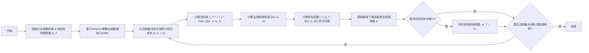
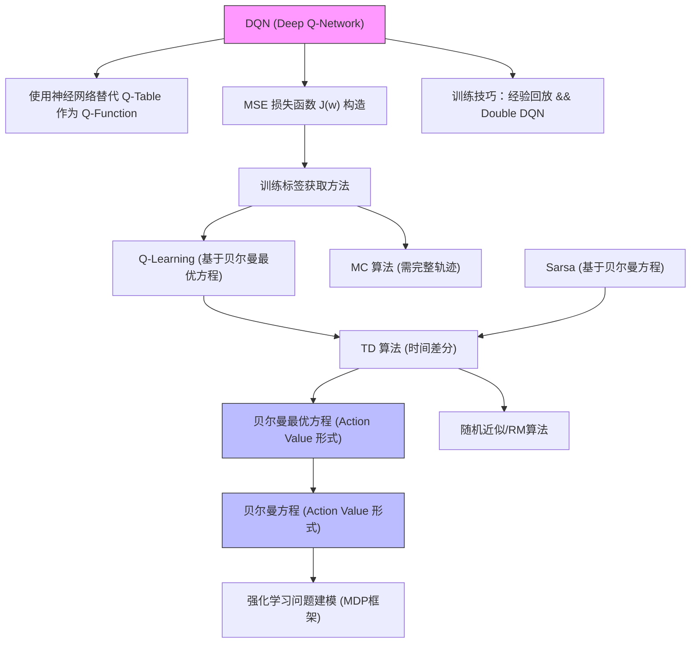

---
{"dg-publish":true,"dg-path":"强化学习-Part 1：From MDP to DQN.md","permalink":"/强化学习-Part 1：From MDP to DQN/","title":"强化学习-Part 1：From MDP to DQN","created":"2025-02-01 14:38:26","updated":"2025-02-16 17:50:11"}
---

# 强化学习-Part 1：From MDP to DQN

在我的心目里强化学习一直是一个很难，但是重要性不是很高的知识点。说他重要性不高，其一是很少有“纯”的强化学习的项目，例如完成某个游戏，控制机器人。虽然 2017 年就有 AlphaGo 的轰动，但是我实践中也没有机会使用。即使在 ChatGPT 的出圈后，我简单了解了他所使用的 RLHF 技术，但是认知也是很肤浅的。其二，实践中很少会走到强化学习这一步，很多替代技术能用更简单的方式，更低的成本完成类似的任务，例如 DPO，SimPO。我自然也不会去用深究更复杂的 PPO。最后，可能是来自 Yann LeCun 有一个知名的 PPT 的认知，“纯”强化学习在深度学习的众多方向里面仅仅是一种点缀。

 然而，随着近期强化学习在 LLM 领域做出了非常 promising 的结果（特指 Deepseek R1），甚至下一个阶段的 scaling law 都与之相关，让我不得不强行“入门”强化学习，系统性地学习。这里我们不谈 Agent，Robot 领域的强化学习的应用，仅从“调整”语言模型的角度看看，如何把强化学习系列技术人引入到 LLM 中，挖掘模型的潜力，从而做到极强的泛化性（甚至是推理能力）。然而在开始之前，我们不得不从强化学习的基础开始，试图揣测这种泛化性从何而来？或者这些强化学习算法是不是这轮推理模型 hyper 的能力来源？

知识参考来源：
* 课程
	* [强化学习的数学原理]( https://www.bilibili.com/video/BV1sd4y167NS )
	* [零基础学习强化学习算法：PPO](https://www.bilibili.com/video/BV1iz421h7gb)
* Paper
	* deepseek r1
	* deepseekMath

总体思路：
* 对决策过程进行建模 MDP
* 求解该模型，对策略进行评估&&获得最优策略
	* value based: 从 value state 出发，先求解 value，再找最优 policy
		* 对 value 建模：贝尔曼方程，贝尔曼最优公式
		* 根据模型是否已知
			* model-based 方法 - value iter && policy iter
			* model-free 的方法
				* non-incremental: MC
				* incremental: TD Learning
					* Saras
					* Q-Learning
		* 连续的 State：From Tabular to Function： value function approximation
			* 使用 function 近似 state value -> $v(s)$
			* 使用 function 近似 action value -> $q(s,a)$
			* DQN
	* policy based：从 policy $\pi$ 出发直接求解 policy -> Policy Gradient
	* value + policy：结合上面的方法 actor-critic
* 补充知识
	* RM 算法，梯度下降的理论基础，用于求解各种期望。
	* Action 的连续化：DPG

## 决策问题建模

对决策建模使用马尔科夫决策过程来描述 MDP
在 [MDP 的维基百科](https://en.wikipedia.org/wiki/Markov_decision_process) 中，把 Agent 与环境交互决策的过程建模为四元组
$$
( S, A, P_{a}, R_{a} ) 
$$

一个更具象的例子：

元组中的每个元素的含义如下
* $S$ 状态空间的**集合** State，也叫状态空间，例如，游戏图像所有像素点的输入，语言模型的 Token 序列 (<t)
* $A$ 动作的**集合** Action，也叫动作空间，例如，游戏的前后左右，语言模型的下一个 Token
* $P_{a}$ 展开是 $P_{a} ( s, s^{\prime} )$ 状态转移的**概率**。就是执行动作 a 时，从一个状态跳转到下一个状态的概率。$P ( s^{\prime} \mid s, a )$
* $R_{a}$ 展开是 $R_{a} ( s, s^{\prime} )$ 即时奖励，这里有几种情况需要讨论
	* $R_{a}$ 只是一个集合，他表示当前状态 $s$，执行动 a 后，跳转到某个 $s^{\prime}$, 获得的奖励。
	* 这个奖励可以是一个确定值，即状态 $s$，执行动 a 后，跳转到某个 $s^{\prime}$ 后, 获得奖励是常数。
	* 这个奖励可以是个概率，即状态 $s$，执行动 a 后，跳转到某个 $s^{\prime}$ 后, 获得奖励是不是固定的值。
	* 值得一提的是，奖励其实可以与 $s^{\prime}$ 无关，只与当前状态和采取的行为有关，即 $R_{a} ( s )$
* 策略（Policy），$\pi( s )$ 根据某个状态输出行动 action

在参考资料 [课程](https://www.bilibili.com/video/BV1sd4y167NS/?p=3&share_source=copy_web&vd_source=febc27170e9bf9e22c2c050dedadc6be) 的中的总结更清晰：

简而言之，我们可以把 MDP 涉及到的概念分为几类
* 集合：状态，动作，奖励
* 概率分布：状态转移概率，奖励的概率（与上面的奖励集合组合起来就是 $R_{a}$）
* 策略：这也是一个概率，只是用来选择 action 的
* 马尔科夫性：这是我们建模的基础假设，memory less 的特点。

> PS： Model based 与 model free 的核心就是 $P_{a}$, $R_{a}$ 相关的概率分布我们是否已知, 这里的已知是指**全局**的已知（整体的概率分布），而不是某一步的已知（例如 sample 一步看看）

在这个基本的定义的基础上，当我们进一步加入时间的维度 $t$，又会出现一些新的概念：
$$
S_{t} \xrightarrow{A_{t}} R_{t+1}, S_{t+1} \xrightarrow{A_{t+1}} R_{t+2}, S_{t+2} \xrightarrow{A_{t+2}} R_{t+3}, \ldots 
$$
* 上面的定义全部都是**随机变量**，他们之间涉及的概率分布有
	* $S_{t} \to A_{t}$ is governed by $\pi( A_{t}=a | S_{t}=s )$
	* $S_{t}, A_{t} \to R_{t+1}$ is governed by $p ( R_{t+1}=r | S_{t}=s, A_{t}=a )$
	* $S_{t}, A_{t} \to S_{t+1}$ is governed by $p ( S_{t+1}=s^{\prime} | S_{t}=s, A_{t}=a )$
* 轨迹 trajectory && episode，就是一条决策的路径，包括（经过的前、后状态、采取的行动以及获得的奖励）。如果 trajectory 可以简单理解为 episode 里面的一段有限的路径。
* Return：一条轨迹的累计的 Reward 的和，是个**随机变量**（Reward 也是随机变量）
* 长期累计奖励（Discounted Return）随机变量 $G_{t}=R_{t}+\gamma R_{t+1}+\gamma^{2} R_{t+2}+\ldots$
* state value：$v_{\pi} ( s )=\mathbb{E} [ G_{t} | S_{t}=s ]$，即 $G_t$ 的条件**期望**，评价某个状态 $s$ 下的具体的价值。
* action value：$q_{\pi} ( s, a )=\mathbb{E}_{\pi} \left[ G_{t} \mid S_{t}=s, A_{t}=a \right]$，执行评价某个状态 $s$ 下，执行某个 action 的具体的价值。

> 关于 state value 与 action value 还有一些补充的说明
> 1. 首先我们应该认知到他们都是“值”，即 Value，不是随机变量
> 2. 他们两之间的关系如下：
> $$ \underbrace{\mathbb{E} [ G_{t} | S_{t}=s ]}_{v_{\pi} ( s )}=\sum_{a}\underbrace{\mathbb{E} [ G_{t} | S_{t}=s, A_{t}=a ]}_{q_{\pi}( s, a )} \pi( a | s ) $$
> $$ q_{\pi} ( s, a )=\sum_{r} p ( r | s, a ) r+\gamma\sum_{s^{\prime}} p ( s^{\prime} | s, a ) v_{\pi} ( s^{\prime} ) $$
> 这种递归的关系也是求解他们的核心

> 注意建模中的细节：各种随机变量与分布告诉我们，整个决策模型**充满了不确定性**：策略 $\pi$ 是不确定的，相同的 state 会得到不同的 action。奖励的也是不确定的，即使相同的 action，获得的 reward 也不一定相同。状态转移也是不确定，在某个状态下执行相同的 action 也会转移到不同的下一个状态

## 模型求解

求解上面的 MDP 模型找到最优策略就是强化学习的主要目标，如何求解模型呢？
强化学习的概念众多，各种求解方法让人眼花缭乱。不同的概念、求解方法用于不同的场景，往往基于不同的假设。
具体而言，我们可以从下面的角度思考假设：
* 什么量是已知的，什么是未知的？
	* 例如全局的状态转移分布是否已知？这导致了我们的求解方法是 model base 还是 model free 的。
	* 我们是否知道完整的轨迹，还是只能 sample 某些 steps？这导致了我们是用 non-incremental（offline 方法，如 MC） 还是 incremental（online 方法，如 TD Learning）的方法。
* 各种变量的性质，例如 state，action 是离散的还是连续的，这导致了我们对 state value 和 action value 使用表格（tabular）表示还是函数（function）表示。

另外一个考虑求解方法的主线是从算法本身思考，把模型求解分为三类主要的思路：
* value-based：总体思路是先求 state/action value，再求 policy。
* police-based：总体思路是直接通过 polciy graident（梯度下降） 求解 policy。
	* Policy Graident 的公式（梯度公式）推导
	* Policy Graident + MC 求 action value -> REINFORCE
* actor-critic：总体思路是在 police-based 的基础上引入 value-based，即两者结合。
	* Policy Graident + TD learning -> actor-critic
	* Importance Sample: on-policy -> off-policy

最后，一个很重要的角度是区分数据的来源，这个我们会在 Q-Learning 部分详细讨论
* on-policy 还是 off-policy：behavior policy（生成数据的策略） 和 target policy（训练的策略） 是否是同一个

本篇文章主要讨论 value-based 的方法（policy-based 的方法和现代方法将在下一篇文章中讨论），他是基础的基础，需要展开一下
* 基础：我们从研究上述模型中各种 state/action value 的关系入手。
	* 通过**贝尔曼公式**来描述他们关系
	* 讨论**贝尔曼最优公式**：一组 greedy 策略下面的贝尔曼公式的形式
* 假设模型已知（P 和 R 分布已知）情况下的求解，
	* 提出 **value iter**/ **policy iter** 来求解最优策略。
* 假设模型未知情况下的求解
	* offline 方法：**MC**，基于采样的方法来估测 value
	* online 方法：
		* **TD Learning**，从 Retrun 定义出发集合 RM 算法推导出使用单步信息（increamental）来迭代逼近求解 state/action value 的方法
			* **Sarsa 算法**：将 TD learning 思想应用到 action value
			* **Q-Learning**
			* 补充：**RM 算法**
		*  **value function Approximation**：上面会先以 tabular 数据作为来构造 state/action value，为了处理连续 state，这里扩展为 function。
			*  **DQN**和他的改进算法

### 贝尔曼公式

根据 state value 的定义我们可以按照如下的公式展开
$$
\begin{aligned} 
v_{\pi}(s) &= \mathbb{E} [ G_t \mid S_t = s ] = \mathbb{E} [ R_{t} + \gamma G_{t+1} \mid S_t = s ] \\
&= \mathbb{E} [ R_{t} \mid S_t = s ] + \gamma \mathbb{E} [ G_{t+1} \mid S_t = {s^{\prime}} ] \\
&= \underbrace{\sum_{a} \pi(a \mid s) \sum_{r} p(r \mid s, a) r}_{\text{mean of immediate rewards}} + \underbrace{\gamma \sum_{a} \pi(a \mid s) \sum_{s^{\prime}} p(s^{\prime} \mid s, a) v_{\pi}(s^{\prime})}_{\text{mean of future rewards}}, \\
&= \sum_{a} \pi(a \mid s) \left[ \sum_{r} p(r \mid s, a) r + \gamma \sum_{s^{\prime}} p(s^{\prime} \mid s, a) v_{\pi}(s^{\prime}) \right], \quad \forall s \in \mathcal{S}.
\end{aligned}
$$

上面是贝尔曼公式的完整形式，下面简写是对最后一行的合并：
$$
v_{\pi} ( s )=r_{\pi} ( s )+\gamma\sum_{s^{\prime}} p_{\pi} ( s^{\prime} | s ) v_{\pi} ( s^{\prime} ) 
$$
其中，
$$
r_{\pi} ( s ) \triangleq\sum_{a} \pi( a | s ) \sum_{r} p ( r | s, a ) r  \qquad
p_{\pi} ( s^{\prime} | s ) \triangleq\sum_{a} \pi( a | s ) p ( s^{\prime} | s, a ) 
$$
我们有**贝尔曼公式的矩阵**形式：
$$
v_{\pi}=r_{\pi}+\gamma P_{\pi} v_{\pi} 
$$

仔细观察上述推导的第一和第二行，包含一个递归的成分，因此
$$
v_{\pi} ( s )=\mathbb{E} [ R+\gamma G | S=s ], \quad s \in\mathcal{S} 
$$
可以写成下面的公式（Bellman expectation equation）：
$$
v_{\pi} ( s )=\mathbb{E} [ R+\gamma v_{\pi} ( S^{\prime} ) | S=s ], \quad s \in\mathcal{S}. 
$$

上面是贝尔曼公式的 state value 形式（$v_{\pi} ( s )$ 相关），同理可以转化为 action value 的形式（$q_{\pi} ( s, a )$）
$$
q_\pi (s, a) = \mathbb{E}_{s' \sim P (\cdot|s, a)} \left[ r (s, a, s') + \gamma \mathbb{E}_{a' \sim \pi (\cdot|s')} \left[ q_\pi (s', a') \right] \right],
$$
### 贝尔曼最优公式

在决策过程中，假设我们使用的是**全局最优策略**（即我们的策略是选择 state/action value最大值进行行动），则**贝尔曼公式**转化为下面的**贝尔曼最优公式**。
下面直接给出贝尔曼最优公式的 element wise 形式：
$$
\begin{aligned} {{v ( s )}} & {{} {} {{}=\operatorname* {m a x}_{\pi} \sum_{a} \pi( a | s ) \left( \sum_{r} p ( r | s, a ) r+\gamma\sum_{s^{\prime}} p ( s^{\prime} | s, a ) v ( s^{\prime} ) \right), \quad\forall s \in\mathcal{S}}} \\ {{}} & {{} {} {{}=\operatorname* {m a x}_{\pi} \sum_{a} \pi( a | s ) q ( s, a ) \quad s \in\mathcal{S}}} \\ \end{aligned} 
$$
其中有一个重要的概念“**最优策略**”：最优策略可以理解为这个策略下，所有状态 $s$ 的 state value $v_\pi (s)$ 都大于等于其他策略下对应状态的 state value
总体来看，贝尔曼最优公式的含义是：最优策略下的 state value，然而最优策略又和 state value 有关，他们形成了一个奇妙的循环。

类似的对于 action value 的形式有
$$
\begin{aligned} {Q^{*} ( s, a )} & {{}=\sum_{s^{\prime}, r} p ( s^{\prime}, r \mid s, a ) \left[ r+\gamma\operatorname* {m a x}_{a^{\prime}} Q^{*} ( s^{\prime}, a^{\prime} ) \right].} \\ {} & {{}=\mathbb{E} \left[ R_{t+1}+\gamma\operatorname* {m a x}_{a^{\prime}} Q^{*} ( S_{t+1}, a^{\prime} ) \mid S_{t}=s, A_{t}=a \right], \quad\forall s, a.} \\ \end{aligned} 
$$

基于这个公式，我们可以迭代求出最优策略

### 值迭代与策略迭代算法（求解最优策略贝尔曼最优公式）

需要强调的是这个算法的前提是知道模型（model based）

|                | **Policy iteration algorithm**                                                                        | **Value iteration algorithm**                                                                                                        | **Comments**                                                                                     |     |
| -------------- | ----------------------------------------------------------------------------------------------------- | ------------------------------------------------------------------------------------------------------------------------------------ | ------------------------------------------------------------------------------------------------ | --- |
| **1)** Policy: | $\pi_0$                                                                                               | N/A                                                                                                                                  | 随机初始化策略                                                                                          |     |
| **2)** Value:  | $v_{\pi_0} = r_{\pi_0} + \gamma P_{\pi_0} v_{\pi_0}$                                                  | $v_0 := v_{\pi_0}$                                                                                                                   | 随机初始化 $v_{\pi_0}$                                                                                |     |
| **3)** Policy: | $\pi_1 = \text{arg max}_\pi (r_\pi + \gamma P_\pi v_{\pi_0})$                                         | $\pi_1 = \text{arg max}_\pi (r_\pi + \gamma P_\pi v_0)$ Policy Update                                                             | 其实是计算 action value - q 函数， **The two policies are the same**                                     |     |
| **4)** Value:  | $v_{\pi_1} = r_{\pi_1} + \gamma P_{\pi_1} v_{\pi_1}$ Policy Evaluation **每一步的更新都依赖当前策略下后续状态的价值估计** | $v_1 = r_{\pi_1} + \gamma P_{\pi_1} v_0$ Value Update **每次更新直接使用后续状态的最优价值估计**，$v_{k+1}=\operatorname* {m a x}_{a} q_{k} ( s, a )$ | 两个算法的核心区别，policy 这里是多次迭代直到 $v_{\pi_1}$ 收敛， $v_{\pi_1} \geq v_1$ since $v_{\pi_1} \geq v_{\pi_0}$ |     |
| **5)** Policy: | $\pi_2 = \text{arg max}_\pi (r_\pi + \gamma P_\pi v_{\pi_1})$ Policy Improvement                   | $\pi'_2 = \text{arg max}_\pi (r_\pi + \gamma P_\pi v_1)$ Policy Update                                                            | 其实是计算 action value - q 函数，找最大值                                                                   |     |
| **⋮**          | **⋮**                                                                                                 | **⋮**                                                                                                                                | **⋮**                                                                                            |     |

Policy Iteration 和 Value Iteration 算法
* 核心基于 **bootstrap** 的思想：**用当前估计值更新自身**，不断迭代直到收敛。
* 上面的实现还包含了动态规划的思想。
* Value iteration 通过反复应用**贝尔曼最优公式**更新值函数，直至收敛。
	* Value iteration 可以用一个公式来表示：（$\operatorname* {m a x}_{\pi}$ 部分对应贝尔曼最优方程的 policy update，最外的等式对应 value update）
$$
v_{k+1}=f ( v_{k} )=\operatorname* {m a x}_{\pi} ( r_{\pi}+\gamma P_{\pi}  v_{k} ), \quad k=1, 2, 3 \ldots 
$$
* Policy Iteration 本质是求解**贝尔曼公式**，但针对固定策略而非最优策略。

> 值得注意的是：这里 Policy/Value Iteration 都是求解“最优策略”（和求解贝尔曼最优公式的目标一致），请注意下面这些概念的区别
> * 求解“贝尔曼公式”，可以看做求解 state value，上面 Policy iteration algorithm 的 Policy Evaluation，是**迭代**求解的过程。类似地，我们下面介绍的 MC 的 Policy Evaluation，TD 方法求解 state value 都可以看作求解“贝尔曼公式”。
> * 求解“贝尔曼最优公式”，一般理解为**直接求解贝尔曼最优公式**，找到最优策略。例如上面的 Value Iteration 和后面的 Q-Learning 算法。核心的区别是这里的 $\operatorname* {m a x}_{\pi}$ 部分，即使用“**最优策略**”来更新。
> * 求解“最优策略”，这里算法（包括下面章节）的主要目的就是找到最优策略，他是在上面求解“贝尔曼公式”的基础上（求 state value）再 Policy Improvement。

### 蒙特卡洛方法（MC）

这种方式还 Model free 的方法，而且是通过**完整**的回合（episode）来估计值函数
当我们不知道状态转移的总体分布与奖励分布的时候，我们可以使用采样的方法来估计 state value。
MC 方法从算法上看是一个 **Policy Iteration** 算法。就是把上一节中的 Policy Evaluation 过程替换为使用 MC 采样来估计值函数。（需要注意的是，这里我们指得是直接估计 action value，与上一节先迭代计算 state value 再计算 action value 不同，因为这一步计算设计状态转移的分布和 Reward 的分布）

Basic MC vs MC Exploring Starts
基础算法中，在每一轮迭代 $k$, 我们是对每个 action value $q(s,a)$ 中的每一个 s 和 a 的 pair，使用当前策略 $\pi_k$ 进行采样计算 average return。
在 Exploring Starts 方法中，在每一轮迭代 $k$, 为了避免（s, a）太多了，是随机 sample 一个 state-action pair $(s_0,a_0)$ 作为一个起点（即 Exploring Start）。然后再根据当前策略 $\pi_k$ 生成动作，直到回合终止（如达到目标或失败）。

First-Visit MC vs Every-Visit MC
这是另外一个问题，主要考虑的是我们 sample 出来的某一条 episode 的路径中，假设某个状态出现了多次，我们应该如何处理的问题，First-visit 只计算出现的第一个 state-action pair 的 return， Every-Visit 则是计算每一个 state-action pair 的 return 取平均。

ε-greedy 策略：就是在我们 Policy Improvement，对策略进行微调，我们不是和之前一样使用 max action value 对应的 action 作为当前状态下的策略，而是增加一个探索的概率，去选择“非最优”的 action。公式如下（$| \mathcal{A} ( s_{t} ) |$ 是状态下动作的数量，$a^{*}$ 是 action value 最大的策略）
$$
\pi( a | s_{t} )=\left\{\begin{array} {l l} {{{1-\frac{| \mathcal{A} ( s_{t} ) |-1} {| \mathcal{A} ( s_{t} ) |} \epsilon,}}} & {{{a=a^{*}}}} \\ {{{\frac{1} {| \mathcal{A} ( s_{t} ) |} \epsilon,}}} & {{{a \neq a^{*}}}} \\ \end{array} \right. 
$$

下面是 MC Exploring Starts 结合 ε-greedy 策略的算法（使用 Every-Visit 提升 episode 利用率，以及 episode 从后向前遍历计算减少重复计算 ）

可以看到 MC 算法的特点是：
* 我们不需要任何对 state 和 value 的 guess，只要对数据 sample 就行
* 他必须要收集一个完整的 episode 才能开始算（需要到最终的状态，offline）
* 使用 ε-greedy 来更新 policy，平衡探索和利用，避免陷入局部最优

> 思考：为什么上一节的 Policy/Value Iteration 没有使用ε-greedy？
> 答: 这里是 Model Free 的方法，概率不知道，需要探索性的随机策略，上一节中使用的是 Model-based 的方法，此时环境模型已知，可以直接计算所有动作的真实值，无需通过交互探索。直接使用 max 直接最大化动作值（确定性策略）

### 时序差分算法（TD Learning）

时序差分算法可能是强化学习里面最重要的算法了，我们在现实世界中往往既没有关于转移状态的分布，也没有完整的 sample 路径。有的只有“一步”的观测。这时候就是 TD 算法起作用了，他是一个迭代更新的（bootstrap）state/action value 的方法.
#### RM 算法
要理解 TD，需要一个数学基础 Robbins-Monro，Robbins-Monro 算法主要解决一个“随机近似”问题（Stochastic Approximation）即求解 $E [ G ( w, X ) ]=0$ 的根的问题。
如何理解 $E [ G ( w, X ) ]=0$，直接要求找到参数 $w$，使得某个**随机函数** $G ( w, X )$  的期望等于零。对 RM 算法所要解决的问题，另一个常见的表述是**求解 $g(w)=0$ 的根**的方法。此时我们不知道函数 $g$ 的具体表达式，我们有的只是采样的数据 $\tilde{g} ( w_{1}), \tilde{g} ( w_{2}) ...$。

> 注意：理解这里两种表达是等价的，他们表达的是一个问题，因为我们假设 $g(w)$ 的数据是随机变量采样来的，求每个样本的 $g(w)=0$ 可以看作是总体期望为 0。

Robbins-Monro 的迭代更新公式如下：
$$
w_{k+1}=w_{k}-a_{k} \tilde{g} ( w_{k}, \eta_{k} ), \qquad k=1, 2, 3, \ldots 
$$
其中
* $w_{k}$ 是第 k 轮对 root 的估计值
* 后面的 $\tilde{g}$ 部分表示的是包含了噪音的采样。$\tilde{g} ( w_{k}, \eta_{k} )=g ( w_{k} )+\eta_{k}$
* $a_k$ 是一个正的系数

对于算法有效性的一个直观的理解如下图

我们可以考察一个特别熟悉的算法**随机梯度下降（SGD）**，其实他是 RM 算法推导出来的一个特例。在 SDG 中，我们优化的目标是最小化下面的 cost function
$$
J ( w )=\mathbb{E} [ f ( w, X ) ] 
$$
求他的最小值，等价于求解梯度为 0
$$
g(w)=\nabla_{w} J ( w )=\mathbb{E} [ \nabla_{w} f ( w, X ) ]=0 
$$
即，求解 $g(w)=0$，**与上面 RM 算法解决的问题相同！**
$$
w_{k+1}=w_{k}-a_{k} \nabla_{w} J ( w ) 
$$
这里的 $a_{k}$ 可以看作是学习率，就是我们在训练神经网络的时候常用的 SGD 算法

#### TD Learning for state value 算法
根据贝尔曼公式的期望形式结合 RM 算法，我们可以自然而然地推导出算法
$$
v_{\pi} ( s )=\mathbb{E} {\big[} R+\gamma G | S=s {\big]}, \quad s \in{\mathcal{S}} 
$$
Bellman expectation equation：
$$
v_{\pi} ( s )=\mathbb{E} \big[ R+\gamma v_{\pi} ( S^{\prime} ) | S=s \big], \quad s \in{\mathcal{S}}. 
$$
我们把等式右边移到左边后就转化为一个类似 $g(w)=0$ 的问题，可以使用 RM 算法来求解
$$
g ( v ( s ) )=v ( s )-\mathbb{E} \big[ R+\gamma v_{\pi} ( S^{\prime} ) | s \big], 
$$
求解 $g(v(s)) = 0$：

$$
\begin{aligned} {v_{k+1} ( s )} & {{} {} {{}=v_{k} ( s )-\alpha_{k} \tilde{g} ( v_{k} ( s ) )}} \\ {} & {{} {{} {}=v_{k} ( s )-\alpha_{k} \Big( v_{k} ( s )-\big[ r_{k}+\gamma v_{\pi} ( s_{k}^{\prime} ) \big] \Big), \quad k=1, 2, 3, \ldots}} \\ \end{aligned} 
$$

我们得到了一个利用采样数据迭代求解 state value 的公式：
* 我们需要的数据是采样的 $\{( s, r, s^{\prime} ) \}$，其实就是 episode 里面的 $\{( s_{t}, r_{t+1}, s_{t+1} ) \}_{t}$
* 公式里面使用的是 $v_{\pi} ( s_{k}^{\prime} )$ ,要求使用的是实际操策略的 state value，但是我们是不知道的，这里用 $v_{k} ( s_{k}^{\prime} )$ 来替代
* **仅更新被访问到的状态**的 state value。我们每一次利用采样数据中 $s_t$ 的 statevalue（即 $v_k(s_t)$ 的值） 被 update，其他状态的 $s$ 值保持不变。
> 补充：我们一般称上面公式中大括号里的内容为 TD Error，括号内减号后面的部分为 TD Target

#### TD Learning for action value - Sarsa 算法

如果我们使用上一小节的方法估计 state value，在不知道转移分布和 Reward 分布的情况下（即 Model free），我们是无法求出 Action Value 的，也就没有办法获得最优策略。因此，我们可以用下面的 Sarsa 算法。
下面是 Sarsa 算法（state-action-reward-state-action）求解 action value 结合策略提升来获取最优策略的算法：

对于 action value 的算法，和上面 state value 基本一致，有一些区别如下：
* 需要的数据是 episode 里面的 $\{( s_{t}, a_{t}, r_{t+1}, s_{t+1},a_{t+1} ) \}_{t}$,（即 state-action-reward-state-action）
* 推导过程是使用 action value $q(s, a)$ 来做的，过程类似，使用的贝尔曼公式： $q_{\pi} ( s, a )=\mathbb{E} \left[ R+\gamma q_{\pi} ( S^{\prime}, A^{\prime} ) | s, a \right], \quad\forall s, a.$
	* 值得注意的是，这里的贝尔曼公式和我们“贝尔曼公式”一节中提出的贝尔曼公式的 state value 形式不太一样。那里的内部有个对下一个 action value 的 expection
	* 核心原因是，这里我们 sample 了下一个 action $a_{t+1}$ ($\{( s_{t}, a_{t}, r_{t+1}, s_{t+1},a_{t+1} ) \}_{t}$ 中的第二个 $a$), 也就是说他是一个下一个动作在这里是一个采样后的确定值，不需要 Expection
	* 如果使用之前的“贝尔曼公式的 state value 形式”推导，就是下面的 Excepted Sarsa，他更加稳定。收敛性更好
* **仅更新被访问到的状态**的 action value，其他的状态保持不变

Sarsa 变体：Expected Sarsa
$$
q_{t+1} ( s_{t}, a_{t} )=q_{t} ( s_{t}, a_{t} )-\alpha_{t} ( s_{t}, a_{t} ) \Big[ q_{t} ( s_{t}, a_{t} )-( r_{t+1}+\gamma\mathbb E [ q_{t} ( s_{t+1}, A ) ] ) \Big]
$$
Where
$$
\mathbb{E} [ q_{t} ( s_{t+1}, A ) ] )=\sum_{a} \pi_{t} ( a | s_{t+1} ) q_{t} ( s_{t+1}, a ) \doteq v_{t} ( s_{t+1} ) 
$$
核心变化：
* TD target 部分变为 Expection 的形式，等价于 state value
* 需要的数据是 episode 里面的 $\{( s_{t}, a_{t}, r_{t+1}, s_{t+1}) \}_{t}$, 即不再需要最后那个 action 了
* 更少的随机变量，预示着，模型的 variance 更小，更稳定
* 这里的推导使用的贝尔曼公式的 state value 形式，相关公式如下
	* $q_{\pi} ( s, a )=\mathbb{E} [ G_{t} | S_{t}=s, A_{t}=a ]$
	* $q_{\pi} ( s, a )=\mathbb{E} \Big[ R_{t+1}+\gamma\mathbb{E}_{A_{t+1} \sim\pi( S_{t+1} )} [ q_{\pi} ( S_{t+1}, A_{t+1} ) ] \Big| S_{t}=s, A_{t}=a \Big], \quad\forall s, a.$
	* $q_{\pi} ( s, a )=\mathbb{E} \Big[ R_{t+1}+\gamma v_{\pi} ( S_{t+1} ) | S_{t}=s, A_{t}=a \Big]$

#### 统一 Sarsa 与 MC： n-step Sarsa
上面的 Sarsa 算法我们只 sample 了一步的 reward $r_{t+1}$，如果我们多走几步, 得到 $( s_{t}, a_{t}, r_{t+1}, s_{t+1}, a_{t+1}, \ldots, r_{t+n}, s_{t+n}, a_{t+n} )$，就会得到 n-step Sarsa 算法，当我们一直 sample 走下去，可以看到这就是 MC 算法。

$$
\begin{array} {l} {{{G_{t}^{( 1 )}=R_{t+1}+\gamma q_{\pi} ( S_{t+1}, A_{t+1} ),}}} \\ {{{G_{t}^{( 2 )}=R_{t+1}+\gamma R_{t+2}+\gamma^{2} q_{\pi} ( S_{t+2}, A_{t+2} ),}}} \\ {{{\vdots}}} \\ \end{array} 
$$
$$
G_{t}^{( n )}=R_{t+1}+\gamma R_{t+2}+\cdots+\gamma^{n} q_{\pi} ( S_{t+n}, A_{t+n} ), 
$$
$$
G_{t}^{( \infty)}=R_{t+1}+\gamma R_{t+2}+\gamma^{2} R_{t+3}+\dots 
$$

对比 TD Learning 和 MC 方法，他们都是 Model-free 的方式来求解 state/action value。他们有什么区别呢
* 最明显的就是 TD 方法只需要“一步”的采样结果（Continuing task），MC 方法需要的是完整的，直到最终状态的所以步骤（Episodic Task）
* 这说明 TD 的方法是 Online 的，MC 的方法是 Offline
* TD 方法我们采样随机变量是 $R_{t+1},S_{t+1},A_{t+1}$（如果是 Action Value 则有 $A_{t+1}$）, MC 方法采样的随机变量是多步的所有 $R$，即 $R_{t+1}+\gamma R_{t+2}...$。显然多个随机变量 sample 求和的结果 variance更大。
* TD 方法是 Bootstrap 的方式 (需要先假设一个初始的 state value，然后迭代)，MC 方法不需要，直接 sample 就可以。

#### Q-Learning

Q-Learning 也是一种 TD Learning 算法的应用，对比上面的算法，他的主要区别是，他**直接估计 optiomal action values**，即贝尔曼最优公式，因此他不需要像前面 Sarsa 那些先 Policy Evaluation 再 Policy Update/improvement，而是，直接估计出最优的 action value。
$$
q_{t+1} ( s_{t}, a_{t} )=q_{t} ( s_{t}, a_{t} )-\alpha_{t} ( s_{t}, a_{t} ) \left[ q_{t} ( s_{t}, a_{t} )-[ r_{t+1}+\gamma\operatorname* {m a x}_{a \in A} q_{t} ( s_{t+1}, a ) ] \right], 
$$
关键点如下：
* 需要的数据 episode 里面的 $\{( s_{t}, a_{t}, r_{t+1}, s_{t+1}) \}_{t}$,
* 推导是求解贝尔曼最优公式的 action value 形式： $q ( s, a )=\mathbb{E} \left[ R_{t+1}+\gamma\operatorname* {m a x}_{a'} q ( S_{t+1}, a' ) \Big| S_{t}=s, A_{t}=a \right], \quad\forall s, a.$ ，当 $r_{t+1}$ 与 $s_{t+1}$ 也已知的时候有我们代入后得到：$q ( s_t , a_t )= r_{t+1}+\gamma\operatorname* {m a x}_{a'} q ( s_{t+1}, a' )$
* **仅更新被访问到的状态**的 action value，其他的状态保持不变

> PS：这里 Q，是 quality 的缩写，表示我们想要学习一个可以衡量（state, action） quality 的 table/function

##### 理解 On-policy vs Off-Policy
* Behavior policy: 生成 sample 的策略
* Target Polciy：updated 的策略

核心是理解，Model-Free 的所有算法都是 **follow one policy 生成采样的数据**，无论是 MC 还是 TD 算法。
* Sarsa: on-policy
* MC: on-policy
* Q-Learning: off-policy，因为**贝尔曼最优公式不涉及策略**，永远都是 max。（隐含了最优策略）
	* $\{( s_{t}, a_{t}, r_{t+1}, s_{t+1}) \}_{t}$, 使用的数据里面的 $a_t$ 可以是任何策略生成的，因此，behavior policy 是 any policy
	* update 公式中使用的是**贝尔曼最优公式**，永远都是 max。（隐含了最优策略）

> PS： Model-based 的方法不需要区分 On-policy / Off-Policy 因为他们不需要与环境交互获取样本。Model-based 使用动态规划方法，所有计算均基于模型的理论推导，与策略的交互无关

下面我们仔细分析一下 Q-Learning 是 off-policy 的说法，这里的确切含义是，Q-Learning 既可以是 on-policy，也可以是 off-policy 的（可以把 on-policy 看作 off-policy 的一种特殊情况），下面分别给出 on-policy 和 off-policy 版本的 Q-Learning 算法：

对比这两个算法，他们的 **update q-value 部分完全相同**，但是有一些核心的不同：
* 数据生成方式不同
	* on-policy 的版本中数据是每一轮迭代生成的，即根据 updated 后的 policy 采样的（可以看出 target 和 behavio 相同策略）
	* off-policy 的版本中，数据是提前一次性生成好的，即使用独立的策略 $\pi_{b}$ sample 生成。
* update policy 的方式不同
	* on-policy 中，update policy 是使用 ε-greedy 策略，目的是为了 **sample 数据的时候能有探索性**。
	* off-policy 中，update 就是贪心的去 action value 的最大值，这就是我们优化的目标
我们可以看到 off-policy 策略的方式和实践更加契合，我们往往是先构造好数据集，再更具数据迭代更新策略。这样策略的更新更加高效。

#### 统一的视角

本节所介绍的 action value 相关的各种 TD update 公式可以统一看作:
$$
q_{t+1} ( s_{t}, a_{t} )=q_{t} ( s_{t}, a_{t} )-\alpha_{t} ( s_{t}, a_{t} ) [ q_{t} ( s_{t}, a_{t} )-\bar{q}_{t} ], 
$$
他们都是在对 action value 的贝尔曼期望公式进行求解：

| Algorithm      | Equation aimed to solve                                                                                                      | Expression of $\bar{q}_t$                                                        |
| -------------- | ---------------------------------------------------------------------------------------------------------------------------- | -------------------------------------------------------------------------------- |
| Sarsa          | BE: $q_\pi(s,a) = \mathbb{E}[R_{t+1} + \gamma q_\pi(S_{t+1}, A_{t+1}) \vert  S_t = s, A_t = a]$                              | $\bar{q}_t = r_{t+1} + \gamma q_t(s_{t+1}, a_{t+1})$                             |
| n-step Sarsa   | BE: $q_\pi (s, a) = \mathbb{E}[R_{t+1} + \gamma R_{t+2} + \cdots + \gamma^n q_\pi (s_{t+n}, a_{t+n})\vert S_t = s, A_t = a]$ | $\bar{q}_t = r_{t+1} + \gamma r_{t+2} + \cdots + \gamma^n q_t(s_{t+n}, a_{t+n})$ |
| Expected Sarsa | BE: $q_\pi (s, a) = \mathbb{E}[R_{t+1} + \gamma \mathbb{E}_{A_{t+1}}[q_\pi (S_{t+1}, A_{t+1})] \vert S_t = s, A_t = a]$      | $\bar{q}_t = r_{t+1} + \gamma \sum_a \pi_t (a \vert s_{t+1}) q_t (s_{t+1}, a)$   |
| Q-learning     | BOE: $q (s, a) = \mathbb{E}[R_{t+1} + \max_a q (S_{t+1}, a) \vert S_t = s, A_t = a]$            | $\bar{q}_t = r_{t+1} + \gamma \max_a q_t(s_{t+1}, a)$                            |
| Monte Carlo    | BE: $q_\pi (s, a) = \mathbb{E}[R_t + \gamma R_{t+2} + \cdots \vert S_t = s, A_t = a]$                                        | $\bar{q}_t = r_{t+1} + \gamma r_{t+2} + \cdots$                                  |

### 值函数近似与 DQN

Value Function 包括 state value function 和 action value function

值函数近似解决了什么问题？
上面我们讨论的迭代算法中，值迭代/策略迭代/时序差分算法这几个都假设了 $v(s)$，$q(s,a)$ 是个表格类型的数据，即状态空间是**离散且有限**的。所以我们才能根据 sample 的数据对某个 $s$ 对应的 state/action value 进行 update。如何状态的个数是连续的，状态就有无限多个呢？
在上面的算法中，我们就不可能对所有的状态 $s$ 的值都 update，只能更新某些状态的数据（这非常稀疏），这显然是有问题。
一个解决的方案是用一个函数来替代表格，我们的 update 作用到函数上，函数也给我们带来了更好的泛化性，缓解稀疏更新的问题。

#### State Value 函数近似

当我们假设 $v_{\pi} ( S )$ 是连续空间的，最直观的理解我们可以把他想象成：一个输入是状态，输出是 state value 的连续函数，典型的可以是一个线性方程，或者一个**神经网络**模型。
我们希望我们有个他的估计 $\hat{v} ( S, w )$ 能够逼近真实的 state value $v_{\pi} ( S )$ ，其中 $w$ 是模型的参数。我们的目标就是求出这个参数。解题的思路是先确定一个 metric 函数（loss），然后优化，这里选择的是 MSE：
$$
J ( w )=\mathbb{E} [ ( v_{\pi} ( S )-\hat{v} ( S, w ) )^{2} ]. 
$$
使用梯度下降可以用迭代更新的方式求出 $w$ (见上文的 RM 算法)
$$
w_{t+1}=w_{t}+\alpha_{t} ( v_{\pi} ( s_{t} )-\hat{v} ( s_{t}, w_{t} ) ) \nabla_{w} \hat{v} ( s_{t}, w_{t} ), 
$$
要 update $w$, 这个算法的核心问题是我们不知到里面的 state value 的真实值 $v_{\pi} ( s_{t} )$，这里的**核心想法**是“用近似的方法求出 $v_{\pi} ( s_{t} )$”，回顾上文，近似 state value 的方法（Model-Free 的）有哪些？
* MC 算法：最暴力的方法就是直接基于当前状态开始 sample 到结束，然后求 average return $g_t$，估算出 state value，即 MC 的方法。$w_{t+1}=w_{t}+\alpha_{t} ( g_{t}-\hat{v} ( s_{t}, w_{t} ) ) \nabla_{w} \hat{v} ( s_{t}, w_{t} )$
* TD 算法：更智慧的方法是使用 TD，增量的 sample 求解, 这里关键点是：使用 TD 的思想，$v_{\pi} ( s_{t} )$ 可以用 $r_{t+1}+\gamma\hat{v} ( s_{t+1}, w_{t} )$ 来近似。导入后就是：$w_{t+1}=w_{t}+\alpha_{t} \left[ r_{t+1}+\gamma\hat{v} ( s_{t+1}, w_{t} )-\hat{v} ( s_{t}, w_{t} ) \right] \nabla_{w} \hat{v} ( s_{t}, w_{t} )$
	* 这里面 $r_{t+1}+\gamma\hat{v} ( s_{t+1}, w_{t} )-\hat{v} ( s_{t}, w_{t} )$ 是 td error
	* $r_{t+1}+\gamma\hat{v} ( s_{t+1}, w_{t} )$ 这个是 td target

> 这里理解 TD 算法， $v_{\pi} ( s_{t} )$ 的期望形式为 $v_{\pi} ( s )=\mathbb{E} {\big[} R+\gamma G | S=s {\big]}, \quad s \in{\mathcal{S}}$, 在已知 $r_{t+1}$ 和 $s_{t+1}$ 的情况下，可以展开为 $v_{\pi} ( s_{t} ) = r_{t+1}+\gamma {v_{\pi}} ( s_{t+1} )$

#### Action Value 函数近似
类似的思想，当我应用到 Action Value 里面（结合 Sarsa 的 TD target 推导出来的）
$$
w_{t+1}=w_{t}+\alpha_{t} \Big[ r_{t+1}+\gamma\hat{q} ( s_{t+1}, a_{t+1}, w_{t} )-\hat{q} ( s_{t}, a_{t}, w_{t} ) \Big] \nabla_{w} \hat{q} ( s_{t}, a_{t}, w_{t} ). 
$$
上述的公式求解 action value $q(s,a)$ 是 Policy Evaluation，结合 Policy Improvement 来求解最优策略的方法如下：

值近似版本的 Sarsa 算法和前面的 Sarsa 算法一样都是 on-Policy 的方法，需要一个具有探索性的策略
再次，当我们把上述方法应用到 Q-Learning 方法中（结合 Q-Learning 的 TD target 推导）
$$
w_{t+1}=w_{t}+\alpha_{t} \Big[ r_{t+1}+\gamma\operatorname* {m a x}_{a \in\mathcal{A} ( s_{t+1} )} \hat{q} ( s_{t+1}, a, w_{t} )-\hat{q} ( s_{t}, a_{t}, w_{t} ) \Big] \nabla_{w} \hat{q} ( s_{t}, a_{t}, w_{t} ), 
$$
对于前面我们讲的 Q-Learning 提供了两个版本 on-Policy 和 off-Policy，

#### DQN

下面我们描述 off-policy 版本的 DQN 算法，这个是我们一般意义上讨论的 DQN

Deep Q-Learning 算法，首先就是基于上面的 Q-Learning with function approximation 引入了深度神经网络。分析前面的公式
$$
w_{t+1}=w_{t}+\alpha_{t} \Big[ r_{t+1}+\gamma\operatorname* {m a x}_{a \in\mathcal{A} ( s_{t+1} )} \hat{q} ( s_{t+1}, a, w_{t} )-\hat{q} ( s_{t}, a_{t}, w_{t} ) \Big] \nabla_{w} \hat{q} ( s_{t}, a_{t}, w_{t} ), 
$$
这里我们用一个神经网络来实现 $\hat{q} ( s_{t}, a_{t}, w_{t} )$ ，让模型输出值等于上式的 TD target（即训练的 ground truth）。就是在解决一个回归问题

> PS：我们这里描述的情况的网络类似上图中间的结构，实际算法中使用的则是有图的结构，即模型的输入是状态 $s$, 输出是多个 action 的值。（action 的数量一般认为有限个）

训练神经网络的 loss 如下（MSE）：
$$
J ( w )=\mathbb{E} [ ( q_{\pi} ( S,A )-\hat{q} ( S,A, w ) )^{2} ]
$$
$$
J ( w )=\mathbb{E} \left[ \left( R+\gamma\operatorname* {m a x}_{a \in\mathcal{A} ( S^{\prime} )} \hat{q} ( S^{\prime}, a, w )-\hat{q} ( S, A, w ) \right)^{2} \right], 
$$
这里我们称上面的 TD Error 为 **“贝尔曼最优误差”（Bellman optimality error）**，这个名字的由来也很直觉，因为 action value 的值在**期望意义上**与 $R+\gamma\operatorname* {m a x}_{a \in\mathcal{A} ( S^{\prime} )} \hat{q} ( S^{\prime}, a, w )$ 相同。即
$$
q ( s, a )=\mathbb{E} \left[ R_{t+1}+\gamma\operatorname* {m a x}_{a \in\mathcal{A} ( S_{t+1} )} q ( S_{t+1}, a ) \Big| S_{t}=s, A_{t}=a \right], \quad\forall s, a 
$$

现在的核心问题变成了如何求解上面的 Loss，我们由于模型的输出 target 值（TD target 部分）无法直接得到，这个值自身也依赖于 $\hat{q} ( s_{t+1}, a, w_{t} )$，他们都依赖于参数 $w$。
针对这个问题，先固定前面 td  target 部分的参数 $w$，只计算后面的 $\hat{q} ( s_{t}, a_{t}, w_{t} )$。对于 Naive 版本的 DQN 算法而言，我们使用**同一个网络**来表示 q function，迭代更新 q 的值，即
* 初始版本的 q 网络是随机的
* 基于随机的版本和上面的 td target 公式，生成训练网络的 ground truth
* 训练 q 网络
* 使用这个新的 q 网络重新生成下一轮的 ground truth，继续迭代 Loop

#### DQN 的基础改进
##### DDQN

这种方法的一个问题是导致**过度估计 (Over Estimation)**。另外一个效果更好的思路是 double DQN（DDQN）
核心想法是：引入**两个网络**，固定一个网络训练另外一个网络，然后过一段时间就把参数同步到另外一个网络。
* main networt，就是代表后面的 $\hat{q} ( s_{t}, a_{t}, w_{t} )$ 部分的网络，我们一直在训练，用 $\hat{q} ( S, A, w )$ 表示。
* target network，代表前面的 td target 的网络 $\hat{q} ( s_{t+1}, a, w_{t} )$，这个我们会 fix 他一段时间，定期从 main network 复制 $w$ 过去，用 $\hat{q} ( S, A, w_T )$ 表示，$w_T$ 是模型的参数。

引入两个网络后，Loss 变为下面的形式：
$$
J=\mathbb{E} \left[ \left( R+\gamma\operatorname* {m a x}_{a \in\mathcal{A} ( S^{\prime} )} \hat{q} ( S^{\prime}, a, w_{T} )-\hat{q} ( S, A, w ) \right)^{2} \right], 
$$
> 另外一个简单的视角：一个 target network 是 main network 的 snapshot

##### 经验回放
问题一：什么是经验回放？
其实非常简单，就是在我们根据策略 sample action 获得 reward，next State 之后，把这一组 turple 放入一个 buffer 里面。以后训练的时候每次都是从这个 buffer sample 一组 mini batch（新旧数据混合），使用这一组数据来训练模型
问题二：**为什么需要经验回放？**
上面的过程非常类似我们训练神经网络的时候准备数据集，为什么需要这样做呢？如果我们检索这个问题，会告诉我们这么做是为了“破坏数据的相关性”，要理解这个问题，需要关心下面几点：
* 在没有 experience replay 之前，我们的方法是沿着一个 episode 顺序的使用这个构造的序列数据。这些相邻的数据往往非常相似，用这种特性的数据来直接训练神经网络，直觉上也是有问题的。（神经网络会学偏了）
* 最重要的是，从数学上看，我们回忆 DQN 的推导是从损失函数 $J ( w )=\mathbb{E} [ ( q_{\pi} ( S,A )-\hat{q} ( S,A, w ) )^{2} ]$ 出发。这里的 Expection 含义是对 state 和 action 求解，隐含了要求“对数据按照分布进行 sample”，因此我们训练需要没有任何的依赖关系。
问题三：除了 DQN，Q-Learning 是否也需要经验回放？
这个问题涉及到对这两个算法关系的深刻理解！
* 理论上，Q-Learning 算法不需要经验回放也可以有效。回忆 Q-Learning 算法的推导过程，他就是对贝尔曼最优公式使用了 RM 算法来近似（TD Learning）, 算法只要求“差分”数据（就是 episode 里面每个 tuple 数据），没有其他的要求。
* 实际上，可以使用经验回放，甚至使用经验回放能提高算法的效率，低于 Naive Q-Learning，我们需要 sample 大量的 episode 然后才有足够的 tuple 数据来 update，如果使用经验回放，我们只需要几千个数据点就够了。这里的原理是：experience replay 大大提高了样本的效率，特别是对于有想相同的 (s, a) 会有“确定性”的 (r, s') 的情况来说重复使用过往的 tuple 数据是合理的。

##### Off-Policy DDQN 算法
下面是一个 off-policy 算法版本 DDQN（来自视频教程）

要点与问题：
* 这里的 off-policy 非常彻底，behavior policy 是 $\pi_b$，在算法开始前 sample 数据放入 replay buffer，后面就没有再 sample 了。
* 每次迭代开始，都是从 buffer 里面 sample batch 数据来训练神经网络
	* 训练的首先会生成 $y_T$ 即训练的目标值
	* 训练的 loss 就是前面介绍的 MSE，做梯度下降更新网络参数
* 对于 DDQN 结构，每过 $C$ 轮，会同步参数到 target policy 中 $w_T$ 中。
* 这里的问题是和很多网上的版本相比有一个显著的不同
	* behavior  policy 生成数据是每一轮迭代完成后使用新的 q function 构造一个ε-greedy 策略（注意：这个策略依赖 q 值！）。基于这个策略再生成新的一批数据放入 replay buffer 里面，然后再 sample batch 数据
	* 注意：这依然是 off-policy，原因是ε-greedy 是 behavior 策略和 target 策略依然是我们训练的 max greddy 策略。只是他们都依赖到了 q function（这里特指 $q(s,w_T)$!）

> 补充一个 DDQN 的伪代码:
> 计算输入： 传代轮数 T，状态特征维度 n，动作集 A，步长α，衰减因子γ，探索率ϵ，当前 Q 网络 Q，目标 Q 网络 Q′，批量梯度下降的基本样本数 m，目标 Q 网络参数更新频率 C。
> 输出: Q 网络参数
> 1. 随机初始化所有的状态和动作对应的 Q 值 Q。随机初始化当前 Q 网络的所有参数 w，初始化目标 Q 网络 Q′的参数 w′ = w。清空经验回放的集合 D。
> 2. for i from 1 to T, 进行迭代。
> a) 初始化 S 为当前时刻状态序列的第一个状态，获取其特征向量φ(S)
> b) 在 Q 网络中使用φ(S) 作为输入，得到 Q 网络的所有动作对应的 Q 值输出。用ε- 贪婪法在当前 Q 值输出中选择对应的动作 A
> c) 在环境中执行当前动作 A,得到新状态 S′对应的特征向量φ(S′) 和奖励 R，是否终止状态 is_end
> d) 将{φ(S), A, R, φ(S′), is_end}这五元组存入经验回放集合 D
> e) S = S′
> f) 从经验回放集合 D 中采样 m 个样本{{φ(Sj), Aj, Rj, φ(S′j), is_endj}, j = 1, 2, ..., m}，计算当前目标 Q 值 yj：
> $$ y_j = \begin{cases}  R_j & \text{if } is\_end_j \text{ is true} \\ R_j + \gamma Q'(φ(S′_j), arg\max_a (Q(φ(S′_j), a, w), w')) & \text{if } is\_end_j \text{ is false}       \end{cases} $$
> g) 使用均方差损失函数
> $$ L = \frac{1}{m} \sum_{j=1}^m (y_j - Q(φ(S_j), A_j, w))^2 $$
> 通过神经网络的梯度反向传播来更新 Q 网络的所有参数 w
> h) 如果 S′是终止状态，当前轮次终止，否则转到步骤 b)
>
> 注解：上述第二步的步骤和步骤中的 Q 值计算都需要通过已训练的 Q 网络计算得到。另外，实际应用中，为了计算较好的收敛，探索率需要随着迭代的进行逐渐减小。
>

## 总结
上面我们自底向上地（Down-Top）介绍了强化学习的基础知识：从对决策问题的建模开始，到第一个使用的深度强化学习算法 DQN。让我再 Top-Down 的整理一下这个问题。从 DQN 往回思考，他是什么？如何把握住他的核心思想，一个脉络是：
* 首先，DQN 是一个**使用神经网络来学习 q value  function 的算法**。使用神经网络来替代了 q-learning 算法中的 q-table，作为 q-function，有了它我们就可以评估模型 action value。通过对 action value（输入为 state）的建模，我们可以找对最优策略。
	* MSE 损失函数 $J(w)$ 的构造，他的求解要求我们获得 label
	* 一些 Trick，经验回放 && Double DQN
* 训练 DQN 网络的 label，即 ground truth 来自于各种方法获取的近似值
	* TD 算法求近似值，-- Q-Learning 算法
	* （可选 MC 算法求近似值，要求我们有完整的 - 到 terminate 状态的 return）
* Q-Learning，使用 TD 算法结合**贝尔曼最优公式**（期望形式），然我们可以使用“差分数据”（单个 state-action-reward-state' 数据）来迭代更新 q 获得 value 的**近似值**
	* TD 算法（Sarsa）的理解，需要我们使用 RM 算法推导贝尔曼公式
	* Q-Learning 也是一种的 TD 算法
* 贝尔曼最优公式（action value 形式）：当策略为贪婪 (max greedy) 的情况下的贝尔曼公式
* 贝尔曼公式（action value 形式）：描述了 action value 之间的关系

