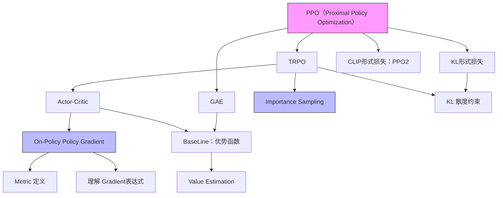

---
{"dg-publish":true,"dg-path":"强化学习-Part 2：Modern Methods.md","permalink":"/强化学习-Part 2：Modern Methods/","title":"强化学习 -Part 2：Modern Methods","created":"2025-02-17 17:09:54","updated":"2025-02-17 17:59:49"}
---

# 强化学习 -Part 2：Modern Methods

上一篇 [[003-Publish/强化学习-Part 1：From MDP to DQN\|强化学习-Part 1：From MDP to DQN]] 我们介绍了强化学习的基本问题，MDP 建模方法，以及 value-based 的强化学习方法。这些方法我归类为传统方案，其中 DQN 方法在 2014 年在雅达利游戏中超过人类选手。本文介绍的 Policy based 以及 Actor-Critic 方法是现在强化学习的主流方法。当然这些方法也大量使用了 value-based 的想法，以及我们上一篇文章介绍的 MC、TD-Learning 等随机近似的方法。
本篇文章，我们会先讨论基于 Policy 的 Policy gradient 方法，REINFORCE。然后讨论 policy 和 value 结合的 actor-critic 方法。基于此，我们会进一步讨论 TRPO 和 PPO 这些现代方法。

我们首先回顾一下，在 MDP 模型的设置下，我们使用了贝尔曼公式和贝尔曼最优公式描述了 state、 action value 的关系。为了估计 value 的值，使用 MC 方法进行估计，或者使用 TD-Learning 来渐进式的估计 value，最后引入 value function 刻画连续状态下的 value 值。利用神经网络强大的泛化性来拟合 value。所有的一切围绕讨论如何求解 value，我们期望求得 action value $q(s,a)$，在此基础上求得 policy（ε-greedy / max greedy）。

Policy-based 方法的基本想法是：我们能不能直接求得策略 Policy，而不是通过先求 action value，再求 policy。
如何直接获得 policy 呢？非常类似优化 value function 的思路，我们还是使用梯度下降的想法。首先定义一个基于 policy 的损失函数（也叫 metrics），然后优化（最大化）这个 metrics，当遇到未知变量的时候，我们尝试用“近似值”替代。

## Policy Gradient

为了直接求解 policy，我们定义 policy 为下面的式子，不同于之前的定义 $\pi ( a | s)$，新增了 $\theta$ 表示策略的参数：
$$
\pi( a | s, \theta) 
$$
这里的策略可以用一个神经网络来表示，他的输入是状态，输出是 action，模型的参数是 $\theta$, 也可以表示为 $\pi_{\theta} ( a | s )$，或者 $\pi_{\theta} ( a,s )$。

> 在上一篇文章中策略定义为 $\pi ( a | s)$，之所以没有参数 $\theta$, 是因为我们的策略不需要参数，他要不是从 $q(s,a)$ 里面 greedy 求出，要不是结合 ε-greedy 策略给出。

我们定义，和策略相关的 metric，目的是“只要优化 metrics，是得 metrics 最大，我们就能得到最优的策略”

### Metrics
Metric 1：**Average state value**
$$
\bar{v}_{\pi}=\sum_{s \in\mathcal{S}} d ( s ) v_{\pi} ( s ) 
$$
* 这是对所有 state value $v_{\pi} ( s )$ 的加权和。其中 $d(s)$ 是状态 $s$ 的 weight 权重
* $d(s)>=0$ 且 $\sum_{s \in\mathcal{S}} d ( s )=1$
	* 最简单的情况是均匀分布，每个状态的概率相同
	* 如果 $d (s)$ 的分布与策略 $\pi$ 无关，我们可以把这个特殊情况的 metric 记为 $\bar{v}_{\pi}^{0}$
	* 另外一种情况是“稳态分布”（stationary distribution），指的是执行多次（无数次）策略最后收敛到的“状态被访问到的概率”
* 也可以表达为：$\bar{v}_{\pi}=\mathbb{E} [ v_{\pi} ( S ) ]$
Average value 的一个等价表达：discounted reward （**折扣回报** $G_t$）的**期望**。
$$
J ( \theta)=\mathbb{E} \left[ \sum_{t=0}^{\infty} \gamma^{t} R_{t+1} \right] 
$$
> 注意，换个角度理解，这个损失函数可以看作是所有路径 trajectory 的 discounted Return 的加权和（即，期望 $\mathbb{E}\big[G(\tau)\big]$） 

Metric 2：**Average one-step reward**
$$
\bar{r}_{\pi} \doteq\sum_{s \in\mathcal{S}} d_{\pi} ( s ) r_{\pi} ( s )=\mathbb{E} [ r_{\pi} ( S ) ], 
$$
* 这里是对所有状态“**immediate** reward“的加权和。
* $r_{\pi} ( s )$ 的定义是 $s$ 状态下执行所有 action 的 immediate reward 的期望，即$r_{\pi} ( s ) \doteq\sum_{a \in\mathcal{A}} \pi( a | s ) r ( s, a )$
	* 这里的 $r(s,a)$ 是状态 $s$  下执行某个具体动作 $a$ 的**当下的奖励**。他也可能是一个随机变量，$r ( s, a )=\mathbb{E} [ R | s, a ]=\sum_{r} r p ( r | s, a )$
 Average reward 的一个等价表达： reward 的均值的期望
$$
\begin{aligned} {{{}}} & {{} {{} {{} \operatorname* {l i m}_{n \to\infty} {\frac{1} {n}} \mathbb{E} \Big[ R_{t+1}+R_{t+2}+\cdots+R_{t+n} | S_{t}=s_{0} \Big]}}} \\ {{{}}} & {{} {{} {} {{}=\operatorname* {l i m}_{n \to\infty} {\frac{1} {n}} \mathbb{E} \left[ \sum_{k=1}^{n} R_{t+k} | S_{t}=s_{0} \right]}}} \\ {{{}}} & {{} {{} {{}=\operatorname* {l i m}_{n \to\infty} {\frac{1} {n}} \mathbb{E} \left[ \sum_{k=1}^{n} R_{t+k} \right]}}} \\ {{{}}} & {{} {{} {{}=\sum_{s} d_{\pi} ( s ) r_{\pi} ( s )=\bar{r}_{\pi} }}} \\ \end{aligned} 
$$
两个 metrics 可以相互转换
$$
\bar{r}_{\pi}=( 1-\gamma) \bar{v}_{\pi}. 
$$
### 求梯度
我们再回忆一下我们的目标：希望找到一个策略使得上面的 metric 最大化。

基本思路：下面的推导思路与我们上一篇文章中的 [[003-Publish/强化学习-Part 1：From MDP to DQN#State Value 函数近似\|value 的函数近似]]类似。在 metric/损失函数的基础上求导，进行梯度上升/下降。我们会把**求梯度后的形式**转化为**期望的形式**（Expection, $\mathbb{E}\big[...\big]$），然后使用 **RM 算法**迭代求期望的近似解（近似的梯度为 0 时的解 $\theta$ 的值）。同时当表达式里面有未知量（这里分别state value $v_{\pi}(s)$ 或者 action value $q_{\pi}(s,a)$）的时候，再次使用**近似算法**（MC 或者 TD）求解。
基于上面的基本思路，我们观察上面的 metric 公式，有一个“小问题”，上面 metric 的定义都是基于 Reword，我们需要把他们展开为 value（$v_{\pi}(s)$, $q_{\pi}(s,a)$） 和 policy ($\pi (a \mid s, \theta)$) 相关函数。

>  可以对对比 [[003-Publish/强化学习-Part 1：From MDP to DQN#State Value 函数近似\|value 的函数近似]]那里直接就是 state Value，可以直接应该 rm，这里就需要对公式镜像展开化简。

对上面的 metric 求梯度，**直接**给出一个通用的解如下所示（他适用于上面所有的 metric）：
$$
\begin{aligned} {\nabla_{\theta} J ( \theta)} & {{}=\sum_{s \in\mathcal{S}} \eta( s ) \sum_{a \in\mathcal{A}} \nabla_{\theta} \pi( a | s, \theta) q_{\pi} ( s, a )} \\ {} & {{}=\mathbb{E} \big[ \nabla_{\theta} \operatorname{l n} \pi( A | S, \theta) q_{\pi} ( S, A ) \big]} \\ \end{aligned} 
$$
上面第一行到第二行的推导里面这里使用到的一个 log 的导数的公式，我们通过他把梯度最终转化为了“期望”的形式。
$$
\nabla_{\theta} \operatorname{l n} \pi( a | s, \theta)=\frac{\nabla_{\theta} \pi( a | s, \theta)} {\pi( a | s, \theta)} 
$$
这一步推导如下（简而言之，就是从公式里面提取出 state $s$, action $a$ 对应的概率到 Expection 里面）：
$$
\begin{aligned}
\nabla_\theta J &= \sum_{s} d(s) \sum_{a} \nabla_\theta \pi(a \mid s, \theta) q_\pi(s, a) \\
&= \sum_{s} d(s) \sum_{a} \pi(a \mid s, \theta) \nabla_\theta \ln \pi(a \mid s, \theta) q_\pi(s, a) \\
&= \mathbb{E}_{s \sim d} \left[ \sum_{a} \pi(a \mid s, \theta) \nabla_\theta \ln \pi(a \mid s, \theta) q_\pi(s, a) \right] \\
&= \mathbb{E}_{s \sim d, a \sim \pi} \left[ \nabla_\theta \ln \pi(a \mid s, \theta) q_\pi(s, a) \right] \\
&= \mathbb{E}\left[ \nabla_\theta \ln \pi(A \mid S, \theta) q_\pi(S, A) \right]
\end{aligned}
$$
>  上面我们直接给出了梯度的结论，他是如何导出的呢？下面内容作为参考：
>  针对 metric $\mathbb{E} \left[ \sum_{t=0}^{\infty} \gamma^{t} R_{t+1} \right]$ 这可以有两种表述，他们是等价的：
>  1. 训练一个 Policy $\pi (a \mid s, \theta)$ 例如神经网络，在所有的 Trajectory 中，得到 Return 的期望最大。$E ( R ( \tau) )_{\tau-P_{\theta} ( \tau)}=\sum_{\tau} R ( \tau) P_{\theta} ( \tau)$
>  2. 寻找一个 Policy $\pi (a \mid s, \theta)$ 例如神经网络，在**所有**状态 $S$ 下，给出相应的 Action，得到 Return 的期望最大。
> 为了把把公式转化为包含策略 $\pi$ 的形式 我们需要把上面的“1”转化为 “2”：
>  1. 求梯度： $\nabla_{\theta} E_{\tau\sim P_{\theta}} [ R ( \tau) ]=\sum_{\tau} R ( \tau) \nabla_{\theta} P_{\theta} ( \tau) =\mathbb{E}_{\tau\sim P_{\theta}} \left[ R ( \tau) \nabla_{\theta} \operatorname{l n} P_{\theta} ( \tau) \right]$
>  2. 轨迹概率 $P_{\theta} ( \tau)$ 可分解为初始状态分布和策略的乘积： $P_{\theta} ( \tau)=p ( s_{0} ) \prod_{t=0}^{T-1} \pi( a_{t} | s_{t}, \theta) p ( s_{t+1} | s_{t}, a_{t} )$
>  3. 求 2 中的轨迹概率的梯度，$\nabla_{\theta} \operatorname{l n} P_{\theta} ( \tau)=\sum_{t=0}^{T-1} \nabla_{\theta} \operatorname{l n} \pi( a_{t} | s_{t}, \theta)$
>  4. 3 代入 1 中：$\nabla_{\theta} E [ R ( \tau) ]=\mathbb{E}_{\tau\sim P_{\theta}} \left[ R ( \tau) \sum_{t=0}^{T-1} \nabla_{\theta} \operatorname{l n} \pi( a_{t} | s_{t}, \theta) \right]$
>  5. 重点理解这里的 $R(\tau)$ 表示的是一个轨迹 Trajectory 的奖励之和 $\sum_{k=0}^{T-1} \gamma^{k} r_{k}$，他是长期累计奖励（Discounted Reward）**随机变量** $G_{t}$ 的一个**采样（Sample）**，
> 	 1. 由于 $\sum_{k=0}^{T-1} \gamma^{k} r_{k}$ 只是一个采样，所以可能非常不稳定，variance 非常大，
> 	 2. 实践中，我们一步只要考虑时间 $t$ 之后的 reward 就行，$t$ 之前的 reward 应该对当前 action 没有影响。即 $R(\tau)$ 修改为 $\sum_{k=t}^{T-1} \gamma^{k-t} r_{k}$
>  6. $\nabla_{\theta} E [ R ( \tau) ]=\mathbb{E}_{\tau\sim P_{\theta}} \left[ \sum_{t=0}^{T-1} \nabla_{\theta} \operatorname{l n} \pi ( a_{t} | s_{t}, \theta) \sum_{k=t}^{T-1} \gamma^{k-t} r_{k} \right]$
>  7. 考虑 $R(\tau)$ 在这里非常的不稳定，是使用 $E[G_{t}])$ 即轨迹 return 的期望，而不是轨迹 return 的采样来作为 $R(\tau)$ ， $E[G_{t}\mid S_{t}=s, A_{t}=a ]$ 就是 $q_{\pi}(s_t,a_t)$ 的定义!
>  8. 最终我们得到了上面的公式 $\nabla_\theta J = \mathbb{E}_{s \sim d, a \sim \pi} \left[ \nabla_\theta \ln \pi(a \mid s, \theta) q_\pi(s, a) \right]$

基于上面的梯度公式的期望形式，使用 RM 算法迭代估计求解 $\theta$
$$
\theta_{t+1}=\theta_{t}+\alpha\nabla_{\theta} \operatorname{l n} \pi( a_{t} | s_{t}, \theta_{t} ) q_{t} ( s_{t}, a_{t} ) 
$$
根据这个迭代公式，只要我们有后面的采样值就能一步一步的求解出 $\theta$, 其中 $\nabla_{\theta} \operatorname{l n} \pi( a_{t} | s_{t}, \theta_{t} )$ 已知（如果是个神经网络，直接 autograd 既可求出），后面的 $q_t(s_t,a_t)$ 不知道。

### 理解 gradient
分析上面公式的 intuition，首先我们尝试理解里面的 $ln$ 的作用，这可以从两个不同的角度看，然后从 exploit-explore 的角度分析策略梯度的含有。

**角度一**：展开 $\nabla_{\theta} \operatorname{l n} \pi( a_{t} | s_{t}, \theta_{t} )$，我们发现他是一个策略梯度除以策略的形式：
$$
\theta_{t+1}=\theta_{t}+\alpha q_{t} ( s_{t}, a_{t} )\frac{ \nabla_{\theta} \pi( a_{t} | s_{t}, \theta_{t} ) } {\pi( a_{t} | s_{t}, \theta_{t} )}
$$
如果我们不用 $\nabla_{\theta} \operatorname{l n} \pi( a_{t} | s_{t}, \theta_{t} )$，而是直接 $\nabla_{\theta} \pi( a_{t} | s_{t}, \theta_{t} )$，这可能会导致对于**出现次数多**的 action 的偏好。分母部分充当了一个 **normalize** 的作用。例如，有一个 action 序列 $s_1,a_1,s_2,a_2,s_3,a_2,s_4,a_2$, 假设他们的 action value 相同，且都是大于 0，使用这个 trajectory 来 update $\theta$，多导致我们多次 update action $a_2$,  会增大这个 action $a_2$ 的概率，然而可能不是说因为这个 action 本身价值大，只是因为他出现的次数多。

**角度二**：如果再仔细观察策略梯度的更新公式
$$
\theta_{t+1}=\theta_{t}+\alpha\nabla_{\theta} \operatorname{l n} \pi( a_{t} | s_{t}, \theta_{t} ) q_{t} ( s_{t}, a_{t} ) 
$$
其实再 ML 中，我们还有一个常见的任务，多分类的交叉熵包含 $ln$。
$$
L = - \sum_{i=1}^{C} y_i \log p_i
$$
$$
\theta \leftarrow \theta - \alpha \nabla_\theta L
$$
对于某个样本而言，只有一个 $y_i$ 为 1，其他为 0，此时
$$
\theta \leftarrow \theta - \alpha \nabla_\theta log(p_i)
$$
我们可以把学习的策略也看作一个多分类问题（classification task），于是策略梯度的公式可以解释为**使用 action value 加权的多分类 loss**

**角度三**：另外一个现实意义的 intuition 是，我们稍微变形一下：
$$
\theta_{t+1}=\theta_{t}+\alpha\underbrace{\left( \frac{q_{t} ( s_{t}, a_{t} )} {\pi( a_{t} | s_{t}, \theta_{t} )} \right)}_{\beta_{t}} \nabla_{\theta} \pi( a_{t} | s_{t}, \theta_{t} ) 
$$
如此整理后，这个方程可以看成是对策略 $\pi ( a_{t} | s_{t}, \theta_{t})$ 进行梯度上升：随着迭代的进行，在状态 $s_t$ 下，策略对动作 $a_t$ 给予更大概率，我们把 $\beta_{t}$ 看作影响梯度更新的常数：
* 分子部分是 action value，如果一个 action 的 value 越大，则调整 $\theta$ 赋予 action $a_t$ 更大的输出概率，这是鼓励利用学习的知识，即 exploit
* 分母部分是当前的策略 policy，如果当前策略下 $a_t$ 的概率较小，则调整 $\theta$ 赋予 action $a_t$ 更大的输出概率, 这是估计对探索不足的 action 更多探索，即 explore。

## REINFORCE

回忆上一小结，我们通过对 metrics 的参数 $\theta$ 求导得到了梯度的期望形式，然后通过 RM 近似算法得到了对策略参数 $\theta$ 的更新公式
$$
\theta_{t+1}=\theta_{t}+\alpha\nabla_{\theta} \operatorname{l n} \pi( a_{t} | s_{t}, \theta_{t} ) q_{t} ( s_{t}, a_{t} ) 
$$
在这个公式中，我们对 $q_t(s_t,a_t)$ 的值是不知道，因此无法实际使用，显然根据前面的 [[003-Publish/强化学习-Part 1：From MDP to DQN#State Value 函数近似\| Value 函数近似]]一节中估计 $v_{\pi}(s)$ 思想，这里也可以对 $q_t(s_t,a_t)$ 进行近似估计。思路也是两个
* 使用 MC 估计
* 使用 TD Learning 方法估计
当使用 MC 估计的时候就是本节的 REINFORCE 算法。

* 这个算法是一个 online 方法（incremental），因为使用了 MC，我们需要收集完整的路径（sample 到结束，terminate state）才能估计 $q_{\pi}(s_t,a_t)$。 
* 这个算法是一个 on-policy 算法，behavior policy是我们 follow 策略 $\pi(\theta_k)$ ，target policy 也是更新同一个策略的参数 $\theta$。
* 值得注意的是：我们 sample 一条 episode 之后，会对路径上的所有的 $q(s_t,a_t)$ 进行估计（value update），也会工这些估计来进行多谢的 policy update。（更高效一些的计算方法是 episode 的后面向前计算每个 $q(s_t,a_t)$，即 $t$ 是从 $T$ 到 0）
* 策略不需要ε-greedy，因为 $\pi(\theta_k)$ 本身就是个分布，具有探索的特性

## Actor-Critic 算法

上一节我们提到也可以使用 TD Learning 的方法来估计 $q_{\pi}(s_t,a_t)$，TD 方法的一个好处是我们可以 sample 一步（不需要完整的 episode）就可以 apply 来估计 action value，换言之，变成了一个 online 的方法（incremental）。结合了 TD 方法后我们也叫这种方法为 Actor-Critic 算法，至于为什么这么叫，可以看我们下面的分析，还是一个十分形象的叫法。再次回忆 policy gradient 的更新公式
$$
\theta_{t+1}=\theta_{t}+\alpha\nabla_{\theta} \operatorname{l n} \pi( a_{t} | s_{t}, \theta_{t} ) q_{t} ( s_{t}, a_{t} ) 
$$
* 这里面我们更新的策略就是 actor，是他发出了 action
* 这里面的 $q_{t} ( s_{t}, a_{t} )$ 就是 critic，他的作用是对 action state 对 quality 进行了评估
### QAC
最简单的 Actor-Critic（QAC） 算法也很直接，就是同步使用 SARSA 算法估计 quality $q_{t} ( s_{t}, a_{t} )$ 和 update policy

* 这是一个 online 算法
* 这是一个 on-policy 算法，可以看到算法中的 behavior policy 是 follow $\pi(a|s_t,\theta_t)$.
* 策略不需要ε-greedy，因为 $\pi(\theta_k)$ 本身就是个分布，具有探索的特性
### A2C
引入 Advantage 的概念，其核心是在我们的策略梯度的定义中（Expection 形式）引入了 baseline 的概念
$$
\begin{aligned} {\nabla_{\theta} J ( \theta)} & {{} {} {} {} {}=\mathbb{E}_{S \sim\eta, A \sim\pi} \Big[ \nabla_{\theta} \operatorname{l n} \pi( A | S, \theta_{t} ) q_{\pi} ( S, A ) \Big]} \\ {} & {{} {} {} {} {} {} {}=\mathbb{E}_{S \sim\eta, A \sim\pi} \Big[ \nabla_{\theta} \operatorname{l n} \pi( A | S, \theta_{t} ) ( q_{\pi} ( S, A )-b ( S ) ) \Big]} \\ \end{aligned} 
$$
上面公式中的 $b(S)$ 就是我们新加入的 baseline，他的存在不会影响上面策略梯度定义中的 Expection 的值。他只会影响里面随机变量的 bias。通过减去这个 baseline，我们 sample 的部分可以有**更小的方差**，也就是我们会有更稳定的结果。
Baseline 的选择，最优的 baseline 比较复杂，我们忽略，一般选择 state value，即
$$
b ( s )=\mathbb{E}_{A \sim\pi} [ q ( s, A ) ]=v_{\pi} ( s ) 
$$
>  因此，我们有了一个更直观的解释：这里的 Critic 的评估标准是：一个 action 的 quality（$q_{\pi}(s,a)$）是不是是这个状态的平均质量 ($v_{\pi}(s)$) 高？

简单的代入 baseline，参数的梯度上升公式：
$$
\begin{aligned} {\theta_{t+1}} & {{} {} {}=\theta_{t}+\alpha\mathbb{E} \Big[ \nabla_{\theta} \operatorname{l n} \pi( A | S, \theta_{t} ) [ q_{\pi} ( S, A )-v_{\pi} ( S ) ] \Big]} \\ {} & {{} {} {} \doteq\theta_{t}+\alpha\mathbb{E} \Big[ \nabla_{\theta} \operatorname{l n} \pi( A | S, \theta_{t} ) \delta_{\pi} ( S, A ) \Big]} \\ \end{aligned} 
$$
其中，我们定义
$$
\delta_{\pi} ( S, A ) \doteq q_{\pi} ( S, A )-v_{\pi} ( S ) 
$$
是 Advantage Function。（优势函数）
使用随机近似的梯度更新的公式如下：
$$
\begin{aligned} {{\theta_{t+1}}} & {{} {{}=\theta_{t}+\alpha\nabla_{\theta} \operatorname{l n} \pi( a_{t} | s_{t}, \theta_{t} ) [ q_{t} ( s_{t}, a_{t} )-v_{t} ( s_{t} ) ]}} \\ {{}} & {{} {{}=\theta_{t}+\alpha\nabla_{\theta} \operatorname{l n} \pi( a_{t} | s_{t}, \theta_{t} ) \delta_{t} ( s_{t}, a_{t} )}} \\ \end{aligned} 
$$
如[[003-Publish/强化学习-Part 2：Modern Methods#理解 gradient\|理解 Gradient]]  同样的方法，我们也可以像下面这样理解这个更新公式

$$
\begin{aligned} {{\theta_{t+1}}} & {{} {{} {} {} {{}=\theta_{t}+\alpha\nabla_{\theta} \operatorname{l n} \pi( a_{t} | s_{t}, \theta_{t} ) \delta_{t} ( s_{t}, a_{t} )}}} \\ {{}} & {{} {{} {{} {}=\theta_{t}+\alpha\frac{\nabla_{\theta} \pi( a_{t} | s_{t}, \theta_{t} )} {\pi( a_{t} | s_{t}, \theta_{t} )} \delta_{t} ( s_{t}, a_{t} )}}} \\ {{}} & {{} {{} {{}=\theta_{t}+\alpha\underbrace{\left( \frac{\delta_{t} ( s_{t}, a_{t} )} {\pi( a_{t} | s_{t} , \theta_{t} )} \right)}_{\mathrm{s t e p ~ s i z e}} \nabla_{\theta}  \pi( a_{t} | s_{t}, \theta_{t} )}}} \\ \end{aligned} 
$$
可以看到这里的 stepsize 理解也是从 exploit-explore 框架入手，这里 Advantage function 扮演了 exploit 的角色

最后一个问题，由于上面的 Advantage function 有即有 action value $q(s,a)$ 又有 state value $v(s)$, 近似估计起来不是很方便，我们可以利用他们的定义来简单的变形：

$$
\delta_{t}=q_{t} ( s_{t}, a_{t} )-v_{t} ( s_{t} ) \to r_{t+1}+\gamma v_{t} ( s_{t+1} )-v_{t} ( s_{t} ) 
$$

我们可以只依赖 state value $v(s)$ 的近似估计就可以完成 Advantage 的计算了。

* 这里的重点是这里的 advantage function 和 td learning for state value 中的 TD ERROR 的公式一样，就提了出来，
* 依然是 on-policy 的策略
* 策略不需要ε-greedy，因为 $\pi(\theta_k)$ 本身就是个分布，具有探索的特性

### Importance Sample
上面的 policy graident算法都是 on-policy，因为我们再推导策略梯度时候需要满足 $\mathbb{E}_{s \sim d, a \sim \pi} \left[ \nabla_\theta \ln \pi(a \mid s, \theta) q_\pi(s, a) \right]$ 这个公式，要求我们的 action 从策略 $\pi$ sample。即生成数据的 behavior policy 和训练的 target policy 是相同，这限制了我们数据的来源，使用当前策略生成的数据往往是低效（不能使用旧数据训练）。

$$
\mathbb{E}_{X \sim p_{0}} [ X ]=\sum_{x} p_{0} ( x ) x=\sum_{x} p_{1} ( x ) \underbrace{\frac{p_{0} ( x )} {p_{1} ( x )} x}_{f ( x )}=\mathbb{E}_{X \sim p_{1}} [ f ( X ) ] 
$$
* 这里 $p_0$ 可以看作我们的 target policy分布，$p_1$ 看作 behavior policy的分布，即数据的分布。
* 这个公式告诉我们，要在 $p_1$ 的数据上面计算 $f(x)$，即计算 $\frac{p_{0} ( x )} {p_{1} ( x )} x$ 在 $p_1$ 上的期望就等价于计算 $x$ 在 $p_0$ 上的期望，简单理解就是**加权平均**，这个权重 $\frac{p_{0} ( x )} {p_{1} ( x )}$ 称为 importance weight
因此使用 $p_1$ 上的数据来估计 $p_0$ 上的期望的公式如下：
$$
\mathbb{E}_{X \sim p_{0}} [ X ] \approx\bar{f}=\frac{1} {n} \sum_{i=1}^{n} f ( x_{i} ) \mathrm{=} \frac{1} {n} \sum_{i=1}^{n} \frac{p_{0} ( x_{i} )} {p_{1} ( x_{i} )} x_{i} 
$$
一个常见的疑问是：上面的公式中我们需要知道 $p_{0} ( x )$, 如果我已经他的概率为什么不能直接用 $E[X]=\sum p_0(x)x$ 直接求出期望？核心的原因是我们只知道他的概率值，而不知道他的总体分布（即不知道他的分布表达式，无法就和或者求积分），典型的例子是 $x$ 是神经网络的输出值，只知道他的概率，例如策略 $\pi(\theta_k)$。

基于上面 Importance sample 原理，我们给出使用重要性采样的策略梯度
$$
\nabla_{\theta} J ( \theta)=\mathbb{E}_{S \sim\rho, A \sim\beta} \left[ \frac{\pi( A | S, \theta)} {\beta( A | S )} \nabla_{\theta} \operatorname{l n} \pi( A | S, \theta) q_{\pi} ( S, A ) \right] 
$$
引入 Baseline 的版本的梯度是：
$$
\nabla_{\theta} J ( \theta)=\mathbb{E} \left[ \frac{\pi( A | S, \theta)} {\beta( A | S )} \nabla_{\theta} \operatorname{l n} \pi( A | S, \theta) \big( q_{\pi} ( S, A )-v_{\pi} ( S ) \big) \right] 
$$
这里的 $\beta( A | S )$ 就是 behavior policy，我们数据采样的分布
Baseline 版本的公式还能进一步化简，把下面的 update 公式
$$
\theta_{t+1}=\theta_{t}+\alpha_{\theta} \frac{\pi( a_{t} | s_{t}, \theta_{t} )} {\beta( a_{t} | s_{t} )} \nabla_{\theta} \operatorname{l n} \pi( a_{t} | s_{t}, \theta_{t} ) \delta_{t} ( s_{t}, a_{t} ) 
$$
展开 $\nabla_{\theta} \operatorname{l n} \pi( a_{t} | s_{t})$ 约掉分子部分

$$
\theta_{t+1}=\theta_{t}+\alpha_{\theta} \left( \frac{\delta_{t} ( s_{t}, a_{t} )} {\beta( a_{t} | s_{t} )} \right) \nabla_{\theta} \pi( a_{t} | s_{t}, \theta_{t} ) 
$$
同样的我们理解这个更新公式：
* 他的分子部分是 exploit，**只有**充分的利用
* 他的分母部分是固定 behavior policy，因此**没有**对训练的target 策略进行探索

最终的 off policy 版本的 A2C 算法的版本如下：

这个算法中
* 我们**同时**把 importance sample 应用到了 value estimation（TD Learning 算法中）和策略的更新算法中。这种  importance sample 算法可以应该到我们之前提到的各种 on-policy 方法中是他们变为 off-policy
* 我们需要的数据是采样的 $\{( s, a, r, s^{\prime} ) \}$，其实就是 episode 里面的 $\{( s_{t}, a_{t},r_{t+1}, s_{t+1} ) \}_{t}$
	* 对比 TD for state value，多了当前的 action $a_t$, 因为我们 Actor 需要更新策略。
	* 不同于 Sarsa，我们这里并**不需要**下一步 action $a_{t+1}$, 因为我们不需要计算 action value
* 关于 off-policy 何时生成数据，我们可以选择直接在训练开始是 follow 策略 $\beta$ 直接生成需要的数据。更常见的是我们利用算法 off-policy 的特征结合多种方式生成数据，例如可以选择
	* 迭代 n 轮，生成一批数据
	* 使用以前的旧数据 replay 训练
	* 甚至向 on-policy 一样，每一步用 ε-greedy 生成数据

> 一个补充，上面我们假设我们的策略是有限个的 action 输出，即 $\pi( a_{t} | s_{t}, \theta_{t} )$ 例如一个多分类的神经网络，我们有 n 个策略，且我们要求这次 action 的概率全部都大于 0（不能等于 0）。
>  还有一种情况是，Policy 是一个固定的输出，表示连续的动作空间，即 Deterministic Actor，用 $a=\mu( s, \theta) \doteq\mu( s )$ 表示，他只有一个输出 action，就是我们要执行的动作是什么（其他的动作的概率是 0），此时我们策略梯度的公式的形式有些不同，参考 **DPG** 和 **DDPG** 的算法。
>  PS：这里所说的连续动作，常用在**机器人控制**领域，就是如果选择了某个动作，其他的动作概率就是 0。比如动作空间是 0-30 角度的连续值，我们无法给每个值指定概率，只能输出一个具体的角度值。

## Actor-Critic 优化算法
前面，我们讨论基于 Policy Gradient 的 Actor-Critic 算法（A2C），尤其是我们引入了 Importance sample 算法，得到了 off-policy A2C 算法。虽然理论上 off-policy 提高了数据的利用率, 然而 off-policy 算法在实际使用是还是会存在不稳定的问题，例如“离线数据”与当前策略相差过大，重要性采样导致了高的方差，这些问题的存在可能导致总体上并没有提升**有效数据利用率**，反而降低了效率。因此，在现代强化学习中，还是大量使用的一些“精心设计”的 on-policy 算法，例如 TRPO，PPO。他们通过结合一些 off-policy 的思想，达成了更强的性能。
一些优化点包括：
* 使用 on-policy 的迭代策略结合重要性采样
* 约束策略模型参数 $\theta$ 的变化
* 优化 Advantage Function 
	* GAE
	* Clip
### TRPO && PPO
之前 On-Policy 版本的 A2C 方法，样本效率很低，我们**每次 sample 完一个 episode 后只能更新一次策略参数** $\theta$，然后又得重新采样。有没有一种方法能一次 sample 多个 episode 然后多次 update 策略呢？这其实就是把上面我们提出的 Importance Sample 引入 On-Policy 方法中。

> 为什么不能直接在 On-Policy 中采样多个 episode，然后 update 多次参数呢？
> 因为 update 参数之后，策略参数的分布就变了，如果多次更新，旧的 episode 和新的策略就不一致了。其实这个处理方法和 off-policy 一样。

回忆我们学习的A2C 方法， on-policy 版本策略参数的更新公式如下：
$$
\theta_{t+1}=\theta_{t}+\alpha_{\theta} \delta_{t} \nabla_{\theta} \operatorname{l n} \pi( a_{t} | s_{t}, \theta_{t} ) 
$$
Off-policy 版本策略参数的更新公式如下：
$$
\theta_{t+1}=\theta_{t}+\alpha_{\theta} \frac{\pi( a_{t} | s_{t}, \theta_{t} )} {\beta( a_{t} | s_{t} )} \delta_{t} \nabla_{\theta} \operatorname{l n} \pi( a_{t} | s_{t}, \theta_{t} ) 
$$
其中 $\delta_{t}$ 是 Advantage function（优势函数，在很多文章中也用 $A_t$ 表示），下面我们就是把这个 off-policy 版本的更新公式加入到在线策略中。

PPO/TRPO **算法流程**如下：
1. 初始化策略参数 $\theta^0$
2. 在每一轮迭代 k 中
	1. 使用 $\theta^k$ 与环境交互，收集训练数据集，多个 episode 的集合 $\{s_t, a_t\}$ 
	2. 使用 $\theta^k$ 计算所有的 Advantage function $A^{\theta^{k}} ( s_{t}, a_{t} )$
	3. 使用策略梯度**多次迭代优化**目标函数 $J^{\theta^{k}} ( \theta)$（当前 update 的参数是 $\theta$，旧的参数是 $\theta^k$）

上面 $J^{\theta^{k}} ( \theta)$ 的目标函数引入重要性采样，定义如下
我们假设每一轮迭代的当前目标策略参数是 $\theta$, 上一轮的旧策略参数是 $\theta^{\prime}$，
$$
J^{\theta^{\prime}} ( \theta)=\, E_{( s_{t}, a_{t} ) \sim\pi_{\theta^{\prime}}} \left[ \frac{\pi_{\theta} ( a_{t} | s_{t} )} {\pi_{\theta^{\prime}} ( a_{t} | s_{t} )} A^{\theta^{\prime}} ( s_{t}, a_{t} ) \right] 
$$
> PS：如果转化为参数的 update 公式，其实和off-policy 的 A2C 的更新公式一致。

> 下面我们从**策略梯度**开始推导，加入重要性采样, 最后反推出原始的目标函数 $J^{\theta^{k}} ( \theta)$：
>  1. 不含 Importance Sample 的策略梯度： $E_{( s_{t}, a_{t} ) \sim\pi_{\theta}} [ A^{\theta} ( s_{t}, a_{t} ) \bigtriangledown l o g \pi_{\theta} ( a_{t}^{n} | s_{t}^{n} ) ]$
>  2. 加入 importance Sample： $E_{( s_{t}, a_{t} ) \sim\pi_{\theta^{\prime}}} [ \frac{P_{\theta} ( s_{t}, a_{t} )} {P_{\theta^{\prime}} ( s_{t}, a_{t} )} A^{\theta^{\prime}} ( s_{t}, a_{t} ) \nabla l o g \pi_{\theta} ( a_{t}^{n} | s_{t}^{n} ) ]$
>  3. 用条件概率展开 weight， $E_{( s_{t}, a_{t} ) \sim\pi_{\theta^{\prime}}} [ \frac{\pi_{\theta} ( a_{t} | s_{t} )} {\pi_{\theta^{\prime}} ( a_{t} | s_{t} )} \frac{p_{\theta} ( s_{t} )} {p_{\theta^{\prime}} ( s_{t} )} A^{\theta^{\prime}} ( s_{t}, a_{t} ) \nabla l o g \pi_{\theta} ( a_{t}^{n} | s_{t}^{n} ) ]$
>  4. 这里假设了 ${p_{\theta} ( s_{t} )}$ 与 $p_{\theta^{\prime}}( s_{t} )$ 相等，即在不同的策略下，状态出现的概率相同。
>  5. 我们展开 log 的梯度，然后约掉相同的项：$E_{( s_{t}, a_{t} ) \sim\pi_{\theta^{\prime}}} [ \frac{\nabla \pi_{\theta} ( a_{t} | s_{t} )} {\pi_{\theta^{\prime}} ( a_{t} | s_{t} )}  A^{\theta^{\prime}} ( s_{t}, a_{t} )  ]$
>  6. 这里是梯度，去掉求导符号反推出原始的 cost function 是 $E_{( s_{t}, a_{t} ) \sim\pi_{\theta^{\prime}}} [ \frac{ \pi_{\theta} ( a_{t} | s_{t} )} {\pi_{\theta^{\prime}} ( a_{t} | s_{t} )}  A^{\theta^{\prime}} ( s_{t}, a_{t} )  ]$

如果我们对参数 $\theta$ 的更新的太大（步长太长），可能会显著的导致策略变差。TRPO 方法中通过引入约束 KL 散度限制 $\theta$ 变化的范围来缓解这个问题：
$$J_{TRPO}^{\theta^{k}} ( \theta)=J^{\theta^{k}} ( \theta) \quad st. K L \big ( \theta, \theta^{k} \big)< ξ$$
上面的约束入如同在更新时找到一块**信任区域**（trust region），在这个区域上更新策略时能够得到某种策略性能的安全性保证，这就是**信任区域策略优化**（trust region policy optim）。TRPO 就变成了一个带约束条件的优化问题，这个问题一般使用拉格朗日法来求解。实际计算比较复杂，很难优化，实际上我们还是用 PPO 比较多，经验证明，PPO 对比 TRPO 能取得类似的效果。
PPO 则是直接在 $J(\theta)$ 中加入 KL 散度作为 Metric:
$$
J_{P P O}^{\theta^{k}} ( \theta)=J^{\theta^{k}} ( \theta)-\beta K L \big( \theta, \theta^{k} \big) 
$$
* 上面的 KL 散度计算的是不是参数 $\theta$ 的分布的 diff，而是策略 $\pi_{\theta}$ 的输出的两个分布的差异，其实实践中就是两个神经网络输出的两组概率用 KL 散度公式计算一下
* 上面的 $\beta$ 是个动态调整的值，他调整模型需要多关注这个“差异”：
	* 如果 $K L ( \theta, \theta^{k} ) > K L_{m a x}$，增大 $\beta$
	* 如果 $K L ( \theta, \theta^{k} ) < K L_{m i n}$，减少 $\beta$
	* $K L_{m a x}$ 和 $K L_{m i n}$ 是我们设定的超参数
另外一个需要说明的是 PPO 的一个变种 PPO2，他没有使用 KL 散度加入到损失函数中，而是使用 clip 方法来近似

$$
J_{P P O 2}^{\theta^{k}} ( \theta) \approx\sum_{( S_{t}, a_{t} )} m i n \left( \frac{\pi_{\theta} ( a_{t} | s_{t} )} {\pi_{\theta^{k}} ( a_{t} | s_{t} )} A^{\theta^{k}} ( s_{t}, a_{t} ), c l i p \left( \frac{\pi_{\theta} ( a_{t} | s_{t} )} {\pi_{\theta^{k}} ( a_{t} | s_{t} )}, 1-\varepsilon, 1+\varepsilon\right) A^{\theta^{k}} ( s_{t}, a_{t} ) \right) 
$$
对这个公式理解是他通过控制优势的权重的大小来控制策略参数 $\theta$ 的范围：

上图中 x 轴是我们通过 Importance Sample 计算出来的权重， y 轴是变化后的权重（也可以看作 Metric 大小，就是再乘以 $A$），红色的线是上面公式的结果，可以简单理解为控制  Metric 的范围。可以看到
* 如果优势函数为正数，说明执行这个 action 有正收益，我们希望 $\pi_{\theta} ( a_{t} | s_{t} )$ 越大越好。但是我们要限制他和旧的策略 $\pi_{\theta^k}$ 的距离不能过大，即他们权重不要大于 $1+\varepsilon$。防止更新参数后策略输出概率增大太多，导致和现在策略的结果太远。（对应图中，我们不让 metric 变大，直接拉平，这样梯度上升就不会再让他变大）
* 如果优势函数为负数，说明执行这个 action 有负收益，我们希望 $\pi_{\theta} ( a_{t} | s_{t} )$ 越小越好。但是我们要限制他和旧的策略 $\pi_{\theta^k}$ 的距离不能过大，即他们权重不要小于 $1-\varepsilon$。防止更新参数后策略输出概率减少太多，导致和现在策略的结果太远。（对应图中，我们不让 metric 变小，直接拉平，这样梯度上升就不会再让他变小）

>  上面的红线直接看所 metric 函数，就是我们的优化目标，这个目标我们要控制好，不能让他过高（左图，上面的情况一），或者过低（右图，上面的情况 2）

补充 PPO 收集数据过程：
- PPO 每次迭代从多个并行环境中收集固定步数的交互数据。
- 在这些步数内，如果某个 episode 结束，环境会重置到初始状态，这个初始状态可能是随机的（取决于环境）。
- 因此，收集的数据可能包括多个 episode 的开始（从初始状态开始）以及部分未结束的 episode。

### GAE（Generalized Advantage Estimation）

在上面的 Actor-Critic、PPO 算法中，使用 value function 或者 Advantage function 充当 baseline（Critic），回忆Advantage function 的定义如下：
$$
\delta_{t}=q_{t} ( s_{t}, a_{t} )-v_{t} ( s_{t} ) \to r_{t+1}+\gamma v_{t} ( s_{t+1} )-v_{t} ( s_{t} ) 
$$
在实际应用到时候，我们训练网络计算（直接回归）state value ($v(s_t)$)，然后使用 Advantage function 的公式就可以计算出“优势”。
观察上面的公式，可以看出这是对优势函数的**一步估计**，即我们只使用了一步的 reward $r_{t+1}$ 展开了公式来近似估计 action value。这里存在的问题是**虽然估计的方差较小，但是可能偏差较大**。类似我们之前学习的 [[003-Publish/强化学习-Part 1：From MDP to DQN#统一 Sarsa 与 MC： n-step Sarsa\|n-step sample]]，这里我们也可以了使用多步采样，甚至直接 MC 出这个值来。一种更为“先进”的方法是：我们对从 1 步采样的 Advantage 到 n 步的采样的 Advantage 求一个加权平均，这就是 GAE 的思想。

从时间 t 开始，定义 1 步，2 步估计等的 Advantage function 如下：
$$
\begin{align}
A_{\theta}^{1} ( s_{t}, a ) &= r_{t}+\gamma V_{\theta} ( s_{t+1} )-V_{\theta} ( s_{t} ) \\
A_{\theta}^{2} ( s_{t}, a ) &= r_{t}+\gamma r_{t+1}+\gamma^{2} V_{\theta} ( s_{t+2} )-V_{\theta} ( s_{t} ) \\
A_{\theta}^{3} ( s_{t}, a ) &= r_{t}+\gamma r_{t+1}+\gamma^{2} r_{t+2}+\gamma^{3} V_{\theta} ( s_{t+3} )-V_{\theta} ( s_{t} )
\end{align}
$$
每个时间步的 1 步估计的的 Advantage function 公式：
$$
\begin{aligned}
\delta_{t}^{V} &= r_{t}+\gamma V_{\theta} ( s_{t+1} )-V_{\theta} ( s_{t} ) \\
\delta_{t+1}^{V} &= r_{t+1}+\gamma V_{\theta} ( s_{t+2} )-V_{\theta} ( s_{t+1} ) 
\end{aligned}
$$
使用上面的 1 步估计来表示**多步估计**的公式：
$$
\begin{array} {l} {{{A_{\theta}^{1} ( s_{t}, a )=\delta_{t}^{V}}}} \\ {{{A_{\theta}^{2} ( s_{t}, a )=\delta_{t}^{V}+\gamma\delta_{t+1}^{V}}}} \\ {{{A_{\theta}^{3} ( s_{t}, a )=\delta_{t}^{V}+\gamma\delta_{t+1}^{V}+\gamma^{2} \delta_{t+2}^{V}}}} \\ \end{array} 
$$
GAE 就是上面多步估计的加权
$$
A_{\theta}^{G A E} ( s_{t}, a )=( 1-\lambda) ( A_{\theta}^{1}+\lambda* A_{\theta}^{2}+\lambda^{2} A_{\theta}^{3}+\cdots) 
$$

实际在应该的时候我们怎么计算这个 GAE $A_{\theta}^{G A E} ( s_{t}, a )$ 呢？
* PPO 的每个迭代中的采样数据包含一段 episode（可能是部分路径，也可能完整）
* 计算episode 的长度为 $T$，我们需要计算上面所有的 $A_{\theta}^{1}， A_{\theta}^{2}， A_{\theta}^{3} \cdots$ 这种值
	* 计算这些值的时候从 episode 后向前，逆向的方法，就是从 $\delta_{T}^{V}$ 开始，这个计算这个 state-action 的单步 Advantage，特别地，如果这个 episode 状态恰巧是 terminate，那么优势就记为 0，
* 使用加权公式计算 GAE，我们可以一次从后向前计算完成这个episode 的所有 $A_{\theta}^{G A E} ( s_{t}, a )$。

>  本质上，GAE 就是对 advantage function 的值的估计的优化，希望在方差和偏差上去得 balance，实际中，这个方法也非常有效，GAE 基本是现代 PPO 方法标配

## 总结
让我们自上而下的梳理本篇文章，如果要理解现代强化学习中最常用的 PPO 方法，需要我们有一些背景知识。PPO 是一种 On-Policy 的 Actor-Critic 方法，他改进自 TRPO，简化了对策略分布约束的方法。TRPO/PPO 这类方法的核心 Policy Gradient，同时结合了 Importance Sample 实现了在 on-policy 条件下更高的样本效率。此外，这类 AC 方法又要依赖我们上一篇文章中介绍的 Value Function Estimation 来实现 Critic。针对 Value 估计的改进引入了 GAE 方法。

